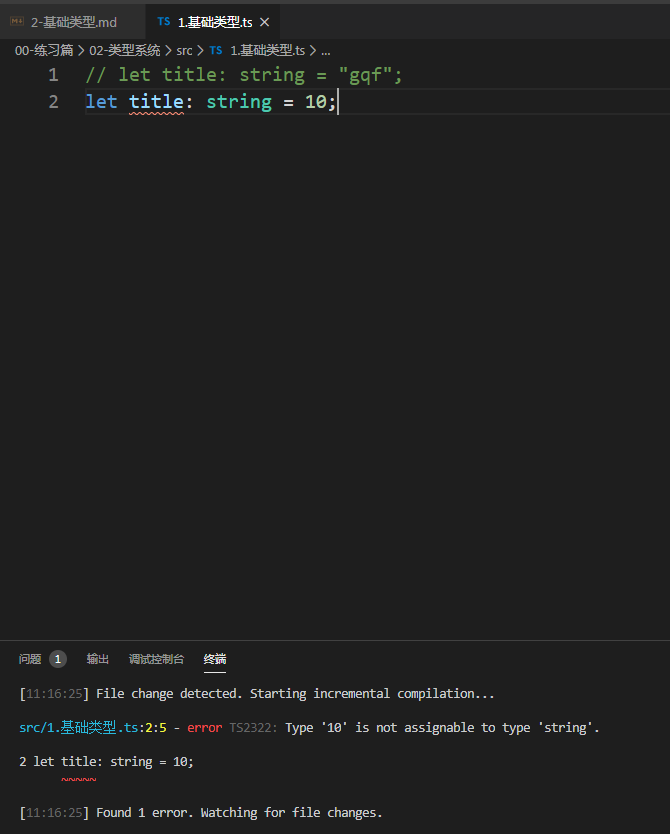
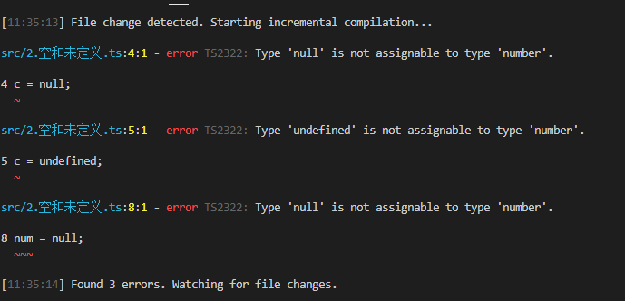
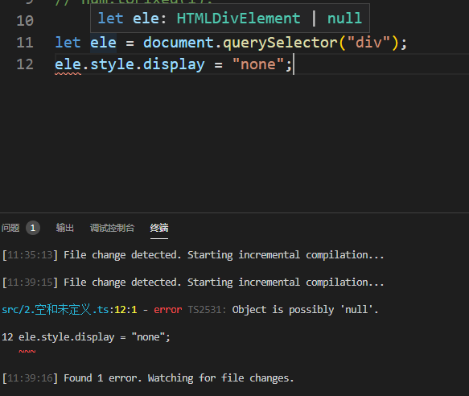

# 2-基础类型

> 知识大纲

* 基础类型包含：string，number，boolean等
* 具体语法
    ```ts
    let title: string = "gqf";
    let n: number = 10;
    let isOk: boolean = true;
    ```
* null和undefined标注后，就不能修改了，因为null和undefined就只有一个值  
* 关于null和undefined类型标注，实际工作中一般也不会用，但这边有一点需要注意下，null和undefined的值是其他类型的子类型，可以给任何类型赋值，如`let d: number;`这行代码，d的默认值是undefined，虽然类型是number
* 关于null和undefined的一些隐藏问题，下面的代码不会报错，但实际运行会有问题，可以增加个配置选项**strictNullChecks**，意思就是严格的空值检查
    ```ts
    let num: number;
    num = null;
    num.toFixed(1);
    ```
* 还可以让我们更安全的获取元素，因为实际开发中，获取个元素可能是个null值       

> 练习

* 回顾知识
    * 在**02-类型系统**下新建tsconfig.json，配置下之前我们学习的一些选项
        ```json
        {
            "compilerOptions": {
                "outDir": "./dist",
                "target": "ES6",
                "watch": true
            },
            "include": ["./src/**/*"]
        }    
        ```
    * 在src下新建**1.基础类型.ts**
        ```ts
        let title: string = "gqf";    
        ``` 
    * 然后在**02-类型系统**下执行tsc，就能看到我们生成的js文件了 

* 本节学习
    * 接着我们把title改成个数字试试，就会发现会报错   

        

    * 新建**2.空和未定义.ts**，来练习下知识大纲中的undefined和null
        ```ts
        let a: null;
        let b: undefined;
        let c: number;
        c = null;
        c = undefined;

        let num: number;
        num = null;
        num.toFixed(1);    
        ```
    * 上述代码在没加**strictNullChecks**是不会报错的，一旦加上就会

        

    * 这边可以在试下获取元素，如果把**strictNullChecks**改为false，这边也就不会提示报错了

        

    * 最终展示下**tsconfig.json**的代码以及**2.空和未定义.ts**的代码
        ```json
        {
            "compilerOptions": {
                "outDir": "./dist",
                "target": "ES6",
                "watch": true,
                "strictNullChecks": true
            },
            "include": ["./src/**/*"]
        }        
        ``` 
        ```ts
        let a: null;
        let b: undefined;
        let c: number;
        // c = null;
        // c = undefined;

        // let num: number;
        // num = null;
        // num.toFixed(1);

        let ele = document.querySelector("div");
        if(ele){
            ele.style.display = "none";
        }        
        ```   


> 目录

* [返回目录](../../README.md)