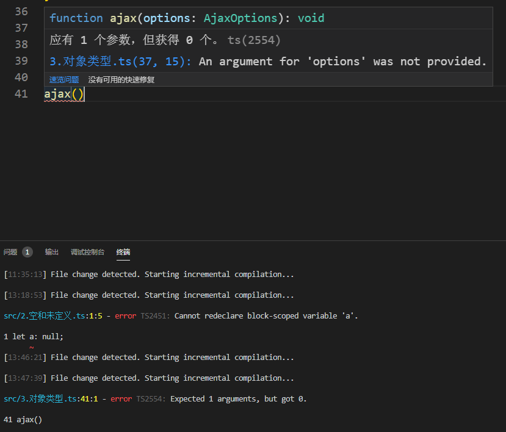
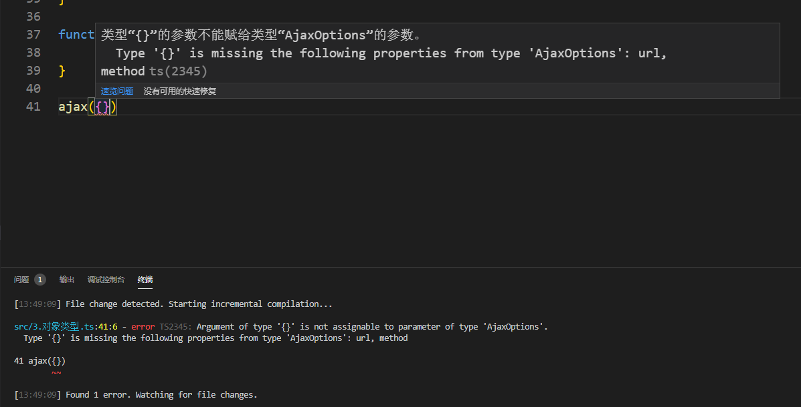
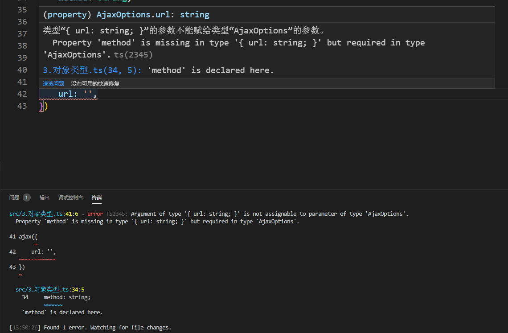

# 3-对象类型

> 知识大纲

* 内置对象类型
    * 在js中，有许多的内置对象，比如：Object，Array，Date等，我们可以通过对象的构造函数或者类来进行标注
        ```ts
        let a: Object = {};
        let arr: Array<number> = [1, 2, 3];
        let d: Date = new Date();
        ```

* 自定义对象类型
    * 另外一种情况，许多时候，我们可能需要自定义结构的对象，这个时候我们可以：
        * 字面量标注
            * 代码如下
                ```ts
                let a: {username: string, age: number} = {
                    username: 'gqf',
                    age: 28
                }
                // ok
                a.username
                a.age
                // error
                a.gender
                ```
            * 优点 - 方便
            * 缺点 - 不利用复用和维护    
        * 接口
            * 代码如下
                ```ts
                interface Person {
                    name: string;
                    age: number;
                };
                let gqf: Person = {
                    name: 'gqf',
                    age: 28
                }                
                ```
            * 优点 - 复用性高
            * 缺点 - 接口只能作为类型标注使用，不能作为具体值，它只是一种抽象的结构定义，并不是实体，没有具体功能实现    
        * 定义类或者构造函数
            * 代码如下
                ```ts
                class Person {
                    constructor(public name: string, public age: number){

                    }
                }

                let userA: Person = new Person('aaa', 10);
                let userB: Person = new Person('bbb', 20);
                console.log(userA);
                console.log(userB);                
                ```
            * 优点 - 功能相对强大，定义实体的同时，也定义了对应的类型
            * 缺点 - 复杂，比如只想约束某个函数接受的参数结构，没有必要去定一个类，使用接口会更加方便  

* 扩展
    * 包装对象 - 这里说的包装对象其实就是js中的String，Number，Boolean，我们知道string类型和String类型并不一样，在ts中也是一样的
    * 代码如下
        ```ts
        let a: string;
        a = '1';
        a = new String('1'); // 报错，String有的string不一定有(对象有的，基础类型不一定有)


        let b: String;
        b = new String('2');
        b = '2'; // 没问题，和上面正好相反
        ```


> 练习

* 新建**3.对象类型.ts**
    ```ts
    let obj: Object = {};
    let arr: Array<number> = [1, 2, 3];
    let data: Date = new Date();

    let user: {name: string, age: number} = {
        name: 'gqf',
        age: 28,
        // gender: 'M', //会报错
    }
    ```
* 上述代码简单使用了下对象的标注，其中user使用了字面量标注，如果我们下一个对象和user结构是一致的，就需要在写一遍字面量标注，所以我们可以使用接口改造下
    ```ts
    interface Person {
        name: string;
        age: number;
    };
    let user: Person = {
        name: 'gqf',
        age: 28,
        // gender: 'M', //会报错
    }

    let gqf: Person = {
        name: 'gqf',
        age: 28
    }    
    ``` 
* 但接口只能用作于标注，没有具体功能实现，所以还有种类的写法
    ```ts
    class Person {
        constructor(public name: string, public age: number){
            this.name = name;
            this.age = age;
        }
    }

    let userA: Person = new Person('aaa', 10);
    let userB: Person = new Person('bbb', 20);
    console.log(userA);
    console.log(userB);    
    ```

* 小练习
    * 先定义个接口和一个方法
        ```ts
        interface AjaxOptions {
            url: string;
            method: string;
        }

        function ajax(options: AjaxOptions){

        }
        ``` 
    * 然后直接调用ajax先不传参数，看下报错信息，会发现报错信息很详细，告诉你缺少一个参数

             

    * 接着我们传入空对象在看下，又会告诉你缺少url和method 

         

    * 紧接着，我们就传个url，编辑器又会告诉你缺少method没有写

          

    * 当然如果你字段拼写错误，照样还是会有错误提示的
    * 当我们url和method都写对了之后就不会再报错了~ 

* 知识大纲的扩展这边小伙伴自行测试                    

> 目录

* [返回目录](../../README.md)