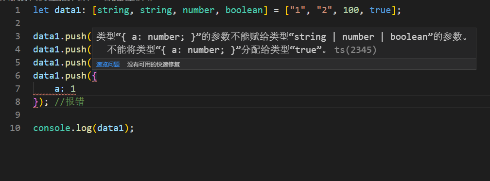

# 4-数组，元组与枚举

> 知识大纲

* 数组类型
    * ts中数组存储的类型必须一致，所以在标注数组类型的，同时要标注数组中存储的数据类型
    * 使用泛型标注
        ```ts
        let arr1: Array<number> = [];
        arr1.push(1);
        arr1.push("gqf"); //报错
        ```
    * 简单标注
        ```ts
        let arr2: string[] = [];
        arr2.push("gqf");
        arr2.push(1); //报错
        ```

* 元组类型
    * 元组类似数组，但是存储的元素类型不必相同，需要注意的是
        * 初始化数据的个数以及对应位置标注类型必须一致
        * 越界数据必须是元组标注中的类型之一(标注越界数据可以不用对应顺序 - 联合类型)
    * 具体代码如下
        ```ts
        let data1: [string, number] = ["gqf", 28];

        data1.push("haha"); //push的数据必须是之前定义元组的联合类型 string或者number
        ```  

* 枚举类型
    * 枚举的作用组织收集一组关联数据的方式，通过枚举我们可以给一组有关联意义的数据赋予一些友好的名字 
    * 具体代码如下
        ```ts
        enum HTTP_CODE {
            OK = 200,
            NOT_FOUND = 404,
            METHOD_NOT_ALLOWED
        }
        HTTP_CODE.OK; // 200
        HTTP_CODE.NOT_FOUND; // 404
        HTTP_CODE.OK = 1; // error

        enum URLS {
            USER_REG = '/user/reg',
            USRR_LOGIN = 'user/login',
            // 如果上一个枚举值是字符串，则后续的枚举值必须手动赋值
        }
        ```  
    * 注意事项
        * key不能是数字
        * value可以是数字，成为数字型枚举，也可以是字符串，成为字符串型枚举，但不能是其他值，默认数字是0
        * 枚举值可以省略，如果省略，则
            * 第一个枚举值默认为0
            * 数字型的枚举，非第一个枚举值为上一个数字枚举值+1
        * 枚举值为只读(常量)，初始化后不可以修改               

> 练习

* 简单练手下ts中数组的语法
    ```ts
    let arr1: number[] = [1, 2, 3];
    let arr2: Array<number> = [4, 5, 6];

    arr1.push(100);
    // arr2.push("100"); //报错    
    ```
* 如果数组中元素类型不一致，那就要使用元组了
    ```ts
    let data1: [string, string, number, boolean] = ["1", "2", 100, true];

    data1.push("200");
    data1.push(false);
    data1.push(300);

    console.log(data1);    
    ```
* 如果前面的元组push了对象就会报错

    

* 枚举类型练习
    ```ts
    enum DIR {
        LEFT = 37,
        UP,
        RIGHT,
        DOWN
    }
    console.log(DIR.LEFT);
    console.log(DIR.UP);
    console.log(DIR.RIGHT);
    console.log(DIR.DOWN);    
    ```    

> 目录

* [返回目录](../../README.md)