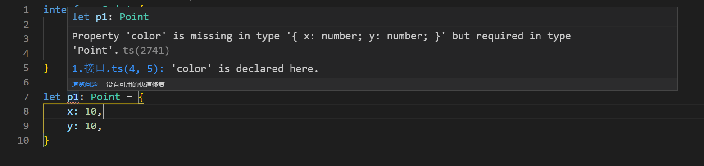
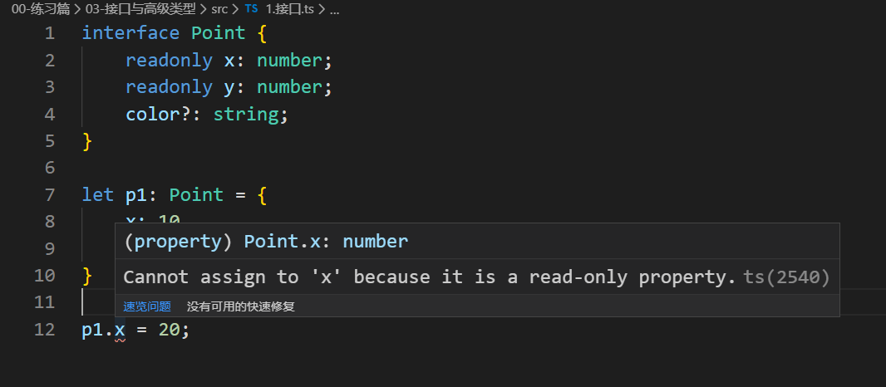
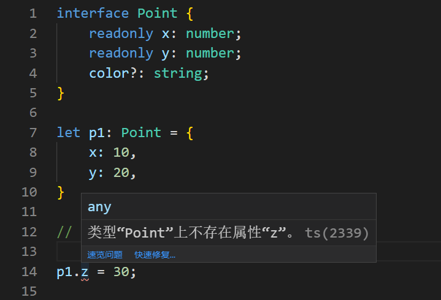
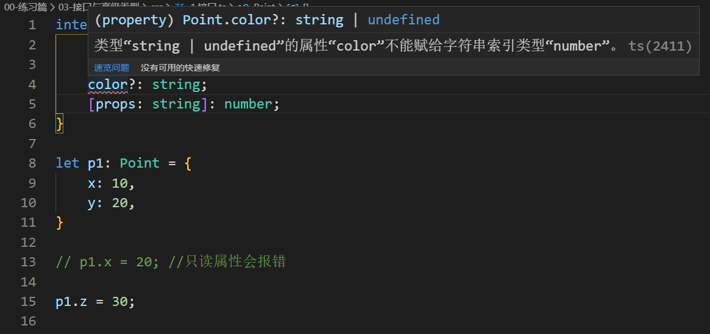
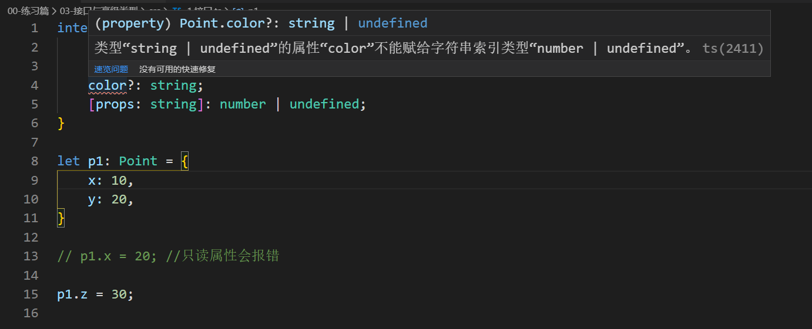

# 1-接口

> 知识大纲

* 可选属性
    * 接口也可以定义可选的属性，通过？来标注
        ```ts
        interface Point {
            x: number;
            y: number;
            color?: string;
        }        
        ```
    * 其中color?表示该属性是可选的 

* 只读属性
    * 我们还可以通过readonly来标注属性为只读
        ```ts
        interface Point {
            readonly x: number;
            readonly y: number;
        }        
        ``` 
    * 当我们标注了一个属性为只读，那么该属性除了初始化以外，是不能被再次赋值的 

* 任意属性
    * 有的时候，我们希望给一个接口添加任意属性，可以通过索引类型来实现
        * 数字类型索引
            ```ts
            interface Point {
                x: number;
                y: number;
                [prop: number]: number;
            }
            ```
        * 字符串类型索引 
            ```ts
            interface Point {
                x: number;
                y: number;
                [prop: string]: number;
            }
            ```  
    * 数字索引是字符串索引的子类型
        * 索引签名参数类型必须为string或者number之一，但两者可以同时出现
        * 具体代码如下
            ```ts
            interface Point {
                [prop: number]: string;
                [prop: string]: string;
            }
            ```   
        * 当同时存在数字类型索引和字符串类型索引的时候，数字类型的值类型必须是字符串类型的值类型或者子类型
            ```ts
            interface Point1 {
                [prop1: string]: string;
                [prop2: number]: number; //错误
            }

            interface Point2 {
                [prop1: string]: Object;
                [prop2: number]: Date; //正确
            }
            ```               

> 练习

* 温故而知新，先来写个简单的接口练手
    ```ts
    interface Point {
        x: number;
        y: number;
    }

    let p1: Point = {
        x: 10,
        y: 20,
    }    
    ```

* 接着我们来增加个color属性，如果不标注可选，就会报错 

    

* 玩一下readonly，在初始化后，如果在对其中的值进行修改，就会报错  

    

* 任意属性练习一
    * 我们先随意写个`p1.z = 30;`，很明显这个是会报错的 

           

    * 然后我们添加的这个属性，key是个字符串类型，值是个number类型，所以我们肯定会这么写`[props: string]: number;`，然而还是会报错  

          

    * 很简单，因为我们这么做就变成双标狗了，上面的color可选属性，如果不写就是个undefined值，所以我们可以使用下联合类型`[props: string]: number | undefined;`，但发现还是在报错

            

    * 其实提示信息已经很明确了，color还有可能是字符串，所以我们只能继续累加`[props: string]: number | undefined | string;`，然后就没有问题了
    * 上述的问题就透露出，不能做双标狗，定义任意属性的时候，要考虑到所有的情况    

* 任意属性练习二    
    * 先来解释下字符串和数字索引，就像js这样，`obj[0]`和`obj['0']`，前者的索引是数字类型，后者的索引是字符串类型，然后两者都出现的时候，数字类型的值类型必须是字符串类型的值类型或者子类型
    * 同时存在数字类型索引和字符串类型索引
        ```ts
        interface PointTest {
            [props: string]: string;
            [props: number]: string;
        }        
        ```
    * 上述代码没有问题，如果把索引为number类型的的值改为number就会报错，要么和string的索引类型的值类型一致要么是子类
    * 接着可以测试Object和Date，也没有问题    
        ```ts
        interface PointTest {
            [props: string]: Object;
            [props: number]: Date;
        }        
        ```

> 目录

* [返回目录](../../README.md)