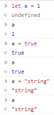
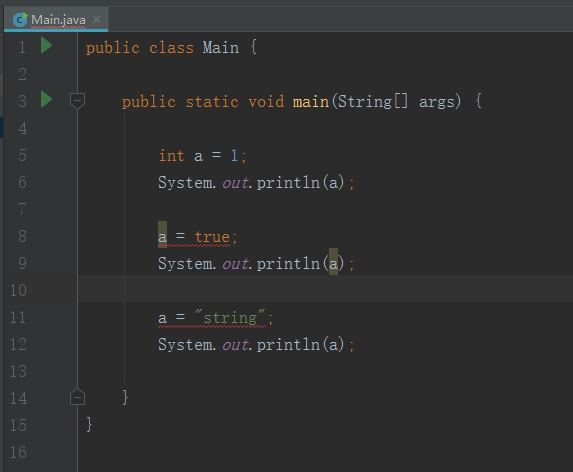
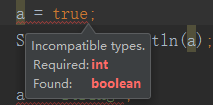
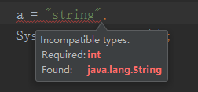

# 强类型与弱类型

* 强类型
    * 强制数据类型定义的语言。也就是说，一旦一个变量被指定了某个数据类型，
        如果不经过强制转换，那么它就永远是这个数据类型了。举个例子：
        如果你定义了一个整型变量 a，
        那么程序根本不可能将 a 当作字符串类型处理。强类型定义语言是类型安全的语言。
* 弱类型
    * 弱类型定义语言：数据类型可以被忽略的语言。
        它与强类型定义语言相反, 一个变量可以赋不同数据类型的值。
* 下面举例说明
    1. javascript
        
        * 我们在浏览器的控制台写了这么几行代码
        
            
            
        * 我们给a先赋值了**1**，数字类型
        * 然后给a又赋值了**true** 布尔类型
        * 最后又给a赋值了**string**，string类型
        * 很明显这个就是弱类型语言了 
        
    2. java
        * 我们在ide里写上这么几行代码
        
            
            
        * 我们可以看到已经编译错误了，鼠标移上去就能看到   
        
            
            
             
            
        * 这个就是强类型的语言，因为我一开始已经定义你是整型变量       
                
> 目录

* [返回目录](../../README.md)                