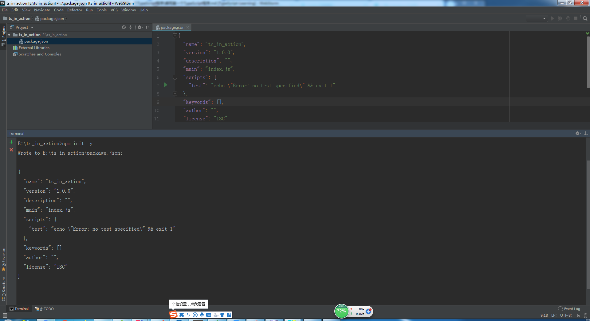
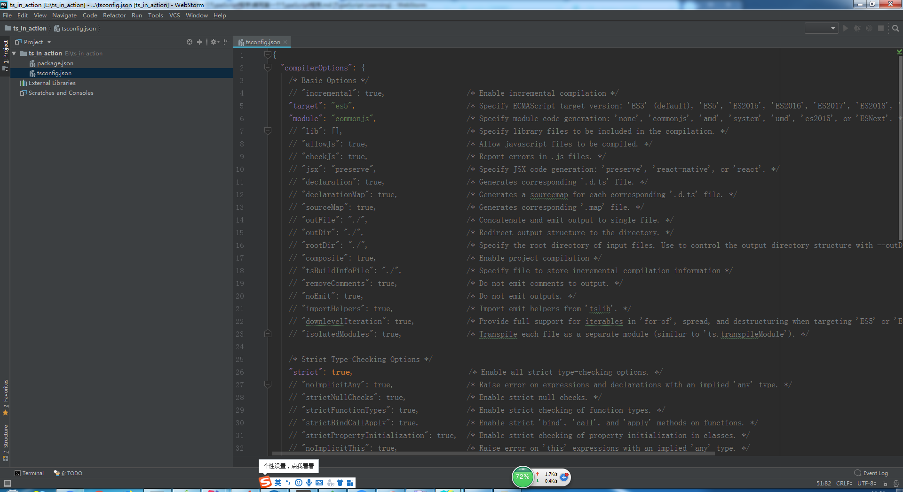
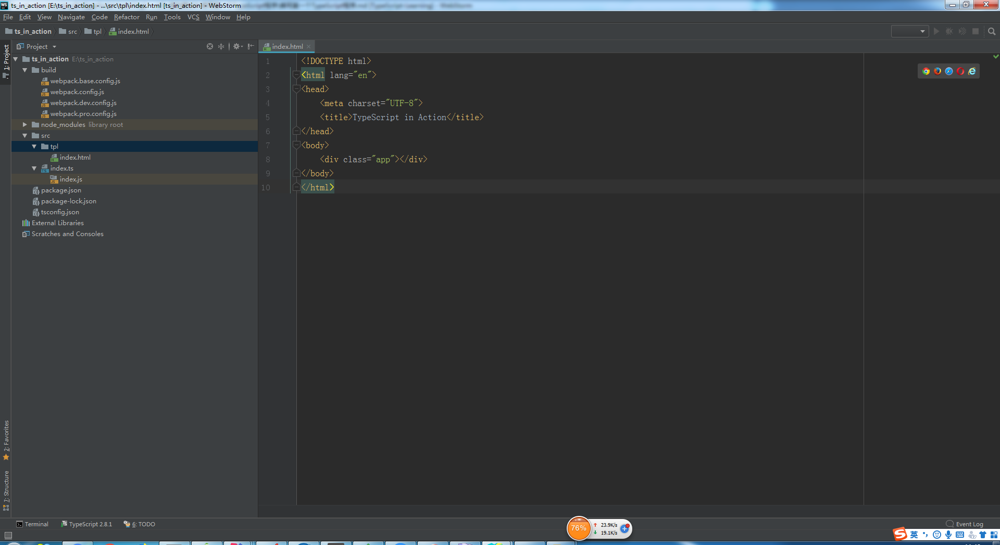
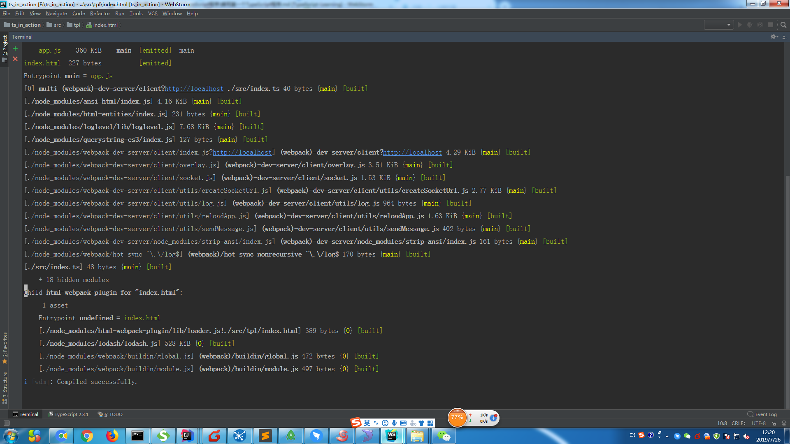
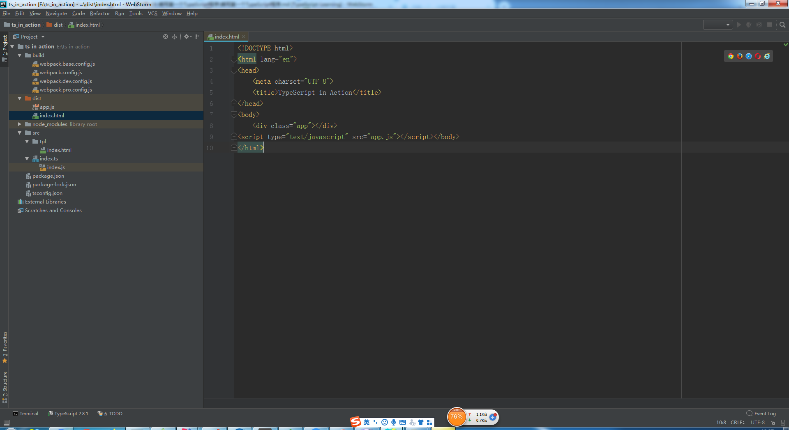

# 编写第一个TypeScript程序

* 准备工作
    * 需要有node的环境，请在[官网](http://nodejs.cn/download/)安装node
    * 新建个项目，这里项目起名为**ts_in_action**
    * 在项目路径下输入指令`npm init -y`，-y的意思就是不用你不停的敲回车，全部采用默认值
    * 然后就能发现项目中多了个配置文件
    
        
        
    * 全局安装ts，这样我们就可以在任何地方都能使用ts的编译器**tsc**
    * 输入指令`npm i ts -g`，等安装完成后，输入tsc，就能看到指令提示的信息，这个大多数可以通过一个配置文件去配置
    * 输入指令`tsc --init`,然后就能看到我们项目中又多了个tsconfig.json  
    
        
    
    * 这些配置选项后续学习中会再次提到
    
* 练习    
    1. 简单写第一个ts程序
        * 我们在项目中新建个**src**的文件，然后新建个**index.ts**的文件
        * 写上这一行代码`let hello:string = "Hello TypeScript";`
        * 我使用的IDE，WS直接编译好生成了对应的js文件，其原理是`tsc ./src/index.ts`
        * 我们可以看下index.js里的代码，发现代码转成了`var hello = "Hello TypeScript";`
        * 这里发现编译的过程，把let改成了var，把类型:string也删除了
        * 我们还可以去ts的[官网](http://www.typescriptlang.org/play/index.html)玩耍这段代码
        * 把ts代码复制到左侧的文本域就可以了
        
            
            
    2. 使用工具
        * 我们使用webpack工具，先安装3个包
        * 输入指令`npm i webpack webpack-cli webpack-dev-server -D`  
        * 我们在项目中新建个build文件夹，用来存放配置文件，
            一共4个配置文件(我已经为小伙伴们准备好了)，把他们copy到build目录下 
            1. **webpack.config.js** - 是所有配置文件的入口  
            2. **webpack.base.config.js** - 是公共环境的配置
            3. **webpack.dev.config.js** - 是开发环境的配置
            4. **webpack.pro.config.js** - 是生产环境的配置   
        * 我们还需要安装ts-loader, 这里注意下我们还要在本地开发环境下在安装下ts，
            使用ts-loader编译typescript
        * 输入指令`npm i ts-loader typescript -D` 
        * 还有一个插件是**html-webpack-plugin**，他的作用是
            1. 为html文件中引入的外部资源如script、link动态添加每次compile后的hash，
                防止引用缓存的外部文件问题
            2. 可以生成创建html入口文件，比如单页面可以生成一个html文件入口，
                配置N个html-webpack-plugin可以生成N个页面入口 
        * 输入指令`npm i html-webpack-plugin -D` 
        * 现在可以简单看下公共环境的配置，具体代码是这样的
            ```
            const HtmlWebpackPlugin = require('html-webpack-plugin')
            
            module.exports = {
                entry: './src/index.ts',
                output: {
                    filename: 'app.js'
                },
                resolve: {
                    extensions: ['.js', '.ts', '.tsx']
                },
                module: {
                    rules: [
                        {
                            test: /\.tsx?$/i,
                            use: [{
                                loader: 'ts-loader'
                            }],
                            exclude: /node_modules/
                        }
                    ]
                },
                plugins: [
                    new HtmlWebpackPlugin({
                        template: './src/tpl/index.html'
                    })
                ]
            }

            ```
            * entry 指定的就是入口
            * output 这里使用默认的  
            * resolve 配置Webpack如何寻找模块所对应的文件，这些文件的后缀是什么
            * module 使用ts-loader根据正则去匹配tsx，然后排除了node_modules下的文件
            * plugins 使用插件
        * 现在我们在src下新建一个tpl目录，在下面新建一个index.html,简单写一下html代码
        
            
            
        * 我们来看下开发环境的配置，这边使用的是官方推荐的dev-tool,他就是**cheap-module-eval-source-map**    
        * 我们在来看下生产环境的配置，他需要引用一个包叫**clean-webpack-plugin**，他的作用是
            清除dist中无用的文件，只用最新的js
        * 输入指令`npm i clean-webpack-plugin -D`
        * 我们之后在来看下所有配置文件的入口，他需要**webpack-merge**这个包，
            同样我们也安装下，作用是把配置文件合并
        * 输入指令`npm i webpack-merge -D`
        * 全部安装好就可以去看下我们的package.json文件了
    3. package.json
        * 插件全部安装好的package.json是这样的  
            ```
            {
              "name": "ts_in_action",
              "version": "1.0.0",
              "description": "",
              "main": "index.js",
              "scripts": {
                "test": "echo \"Error: no test specified\" && exit 1"
              },
              "keywords": [],
              "author": "",
              "license": "ISC",
              "devDependencies": {
                "clean-webpack-plugin": "^3.0.0",
                "html-webpack-plugin": "^3.2.0",
                "ts-loader": "^6.0.4",
                "typescript": "^3.5.3",
                "webpack": "^4.37.0",
                "webpack-cli": "^3.3.6",
                "webpack-dev-server": "^3.7.2",
                "webpack-merge": "^4.2.1"
              }
            }
            ```  
        * 接下来我们来修改下入口，改为`./src/index.ts`   
        * 然后在scripts里编写启动命令,新增
            `"start": "webpack-dev-server --mode=development --config ./build/webpack.config.js",`   
        * 然后**npm start**运行，发现没有任何问题  
        
               
            
        * 然后我们在写下构建生产环境的脚本，同样在scripts下添加代码，我们用build，具体代码是这样的
            `"build": "webpack --mode=production --config ./build/webpack.config.js",`
            
        * 最终代码是这样的
            ```
            {
              "name": "ts_in_action",
              "version": "1.0.0",
              "description": "",
              "main": "./src/index.ts",
              "scripts": {
                "start": "webpack-dev-server --mode=development --config ./build/webpack.config.js",
                "build": "webpack --mode=production --config ./build/webpack.config.js",
                "test": "echo \"Error: no test specified\" && exit 1"
              },
              "keywords": [],
              "author": "",
              "license": "ISC",
              "devDependencies": {
                "clean-webpack-plugin": "^3.0.0",
                "html-webpack-plugin": "^3.2.0",
                "ts-loader": "^6.0.4",
                "typescript": "^3.5.3",
                "webpack": "^4.37.0",
                "webpack-cli": "^3.3.6",
                "webpack-dev-server": "^3.7.2",
                "webpack-merge": "^4.2.1"
              }
            }

            ```                     
        * 然后运行**npm run build**，然后发现dist目录下就有我们要的东西了,js也在我们的页面中生成了
        
            