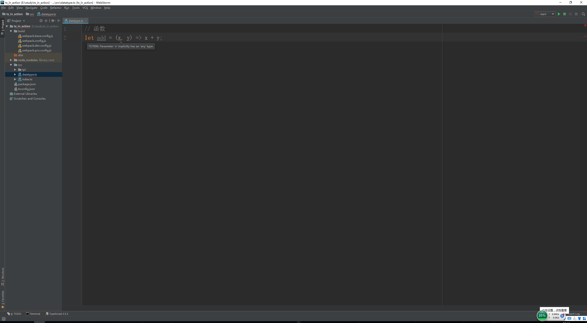
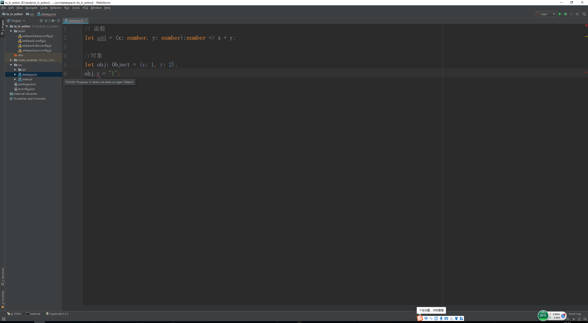
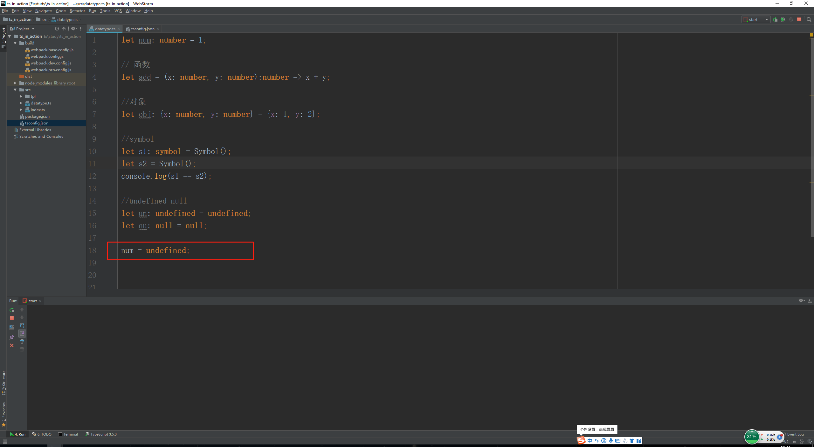

# 基本类型

> 知识大纲

1. ES6的数据类型
    * Boolean
    * Number
    * String
    * Array
    * Function
    * Object
    * Symbol
    * undefined
    * null
2. TypeScript的数据类型
    * Boolean
    * Number
    * String
    * Array
    * Function
    * Object
    * Symbol
    * undefined
    * null
    * **void**
    * **any**
    * **never**
    * **元组**
    * **枚举**
    * **高级类型**
3. TS多了几个类型，就是上述加粗的类型分别是void，any，never，元组，枚举，高级类型
4. 类型注解
    1. 作用: 相当于强类型语言中的类型声明
    2. 语法: (变量/函数): type 
    
> 练习

1. 我们在上次的项目中，src下新建一个**datatype.ts**  
2. 在index.ts中把它引入进来，代码是`import './datatype'`
3. 我们现在可以在datatype.ts愉快的编写代码了
    1. 原始类型
        1. 具体代码如下
            ```
            // 原始类型
            let bool: boolean = true;
            let num: number = 3;
            let str: string = "abc";
            ```   
        2. 如果我们为字符串类型str赋值个数字会怎么样？编辑器会报错
        
             
            
        3. 但我们的js文件还是照样生成了
        
            
            
        4. 这里就能体会出来ts和js的区别，ts的变量类型是不可以被改变的(强类型)
        
    2. 数组
        1. 具体代码如下 
            ```
            // 数组 定义有2种方式
            let arr1: number[] = [1, 2, 3];
            let arr2: Array<number> = [1, 2, 3];
            ```       
        2. 这2种定义是等价的，意思是我们的数组里的元素必须是number类型
        3. 我们可以为其中一个数组添加个字符串成员看下会怎么样？编辑器还是会报错
        
             
            
        4. 我们可以使用这样一个语法，让数组既可以支持数字，又可以支持字符串 
        
            * `let arr2: Array<number | string> = [1, 2, 3, "abc"];`   
            * 这样我们里面的元素就可以可以是数字也可以是字符串啦，任性~   
            
    3. 元组
        1. 元组是特殊的数组，它规定了数组的类型和长度
        2. 具体代码如下   
            ```
            //元组
            let tuple: [number, string] = [1, "1"];
            ```
        3. 比方说我们把第一个数字的1改成字符串看下，历史继续重演   
        
            
            
        4. 我们恢复下现场，给元组添加个元素
        
             
            
        5. 越界问题
            * 元组可以像数组一样push元素，我们发现push元素ts编译并没有报错，
                而且可以在浏览器控制台看到信息
            
                
                
                
                
            * 然后我们去用下标访问下添加的元素，发现也没有报错
                
                
                
            * 但不建议这么使用，元组就是规定了数组的长度和类型    
                
    4. 函数  
        1. 我们先写个简单的函数，用箭头函数
            * `let add = (x, y) => x + y;`
            * 我们能看到ts编译已经报错了
            
                             
        
        2. 改用ts，具体代码如下    
            * `let add = (x: number, y: number):number => x + y;`
            * 解释下这段代码
                1. 参数x是个number类型
                2. 参数y是个number类型
                3. 函数add返回值也是个number类型
                4. 通常函数的返回值可以省略，是因为ts它自己会推断，2个参数是number型所以相加也是number型
                5. 所以这里函数返回值没有写，ts编译也不会报错
                
    5. 对象
        1. 先简单写个对象
            * `let obj: Object = {x: 1, y: 2};`    
            * 在js中，我们修改对象的属性值可以任意修改，比如把原本x的1(数字类型)改为字符串"1"   
            * 但在ts中是不行的，你没有规定每个属性的类型，会导致编译错误，如下图所示 
            
                 
            
            * 因为我们没有规定该对象的属性是什么类型       
        2. 正确的写法是这样的，上代码
            * `let obj: {x: number, y: number} = {x: 1, y: 2};`  
            * 然后小伙伴可以自行更改x和y的值，如果改数字肯定没问题，改其他类型编译还是会出错的
            
    6. symbol
        1. symbol的含义就是具有唯一的值
        2. 有2种声明的方式
            ```
            let s1: symbol = Symbol();
            let s2 = Symbol();
            console.log(s1 == s2);
            ```        
        3. 这2个是不等的，上述console打印的是false      
        
    7. 特殊的数据类型    
        1. undefined和null
            * 我们可以为变量声明undefined和null
                ```
                let un: undefined = undefined;
                let nu: null = null;
                ```
            * 特殊的地方在哪里？  
                1. 默认情况下      
                    * 如果一个变量被声明是undefined，那他只能被undefined赋值，其他赋值会编译报错
                    * 当然前面声明的变量比如number类型的boolean类型的也不能被赋值undefined
                    * 同理null也是一样的规则
                    * 这里来个截图，是编译错误的案例
                        
                        
                        
                2. ts官方表示undefined和null可以作为任何类型的子类，但要修改下配置文件    
                    * 打开tsconfig.json
                    * 其中有一个属性叫strictNullChecks，把注释打开然后改为false就可以了
                    * 然后我们在来看前面的代码，前面的报错信息就没有了
                    
                        
                        
                3. 对了，如果不修改配置文件的也想通过编译，我们还可以使用多类型
                    * `let num: number | undefined = 1;`  
        2. void
            * 做过java的应该很清楚，这个就是无返回值
            * void可以让任何函数返回undefined，这和js的一样，如果没有返回值，默认返回undefined  
            * 具体代码是这样的  `let noReturn = ():void => {};`   
            
        3. any
            * 在ts中如果声明变量的时候不给类型，那就是默认any类型了，这就和我们js一样了
                ，这个变量想怎么赋值就怎么赋值
            * 一般不建议使用any，如果都定义成any，那就没必要用ts了
            
        4. never
            * never表示永远没有返回值的类型
            * 一般有2种情况返回值是never
                1. 抛出个异常
                    ```
                    let error = () => {
                        throw new Error("error");
                    };
                    ```
                2. 死循环   
                    ```
                    let endless = () => {
                        while(true){}  
                    };
                    ```                      

> 目录

* [返回目录](../../README.md)                    