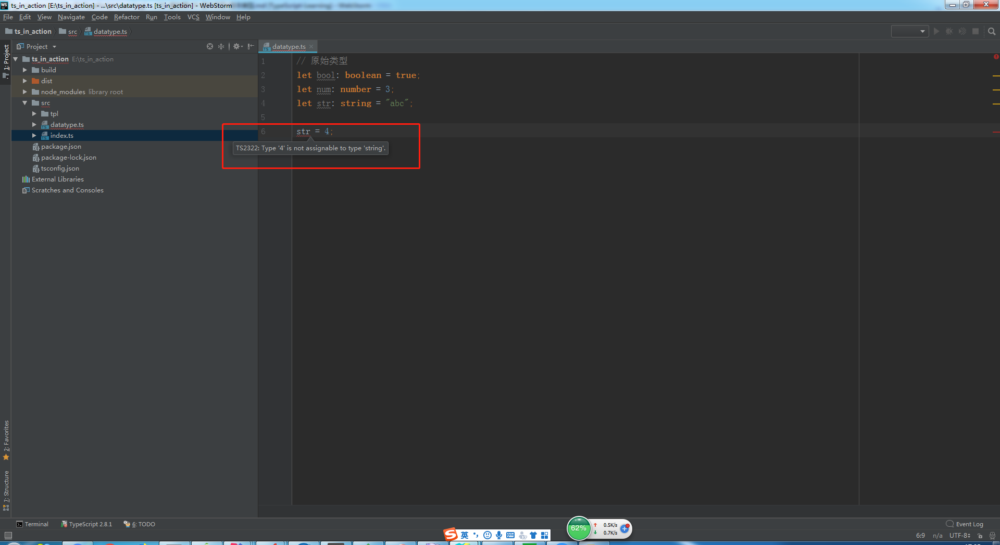
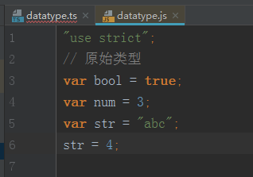
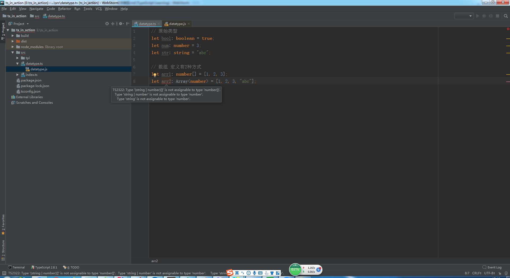
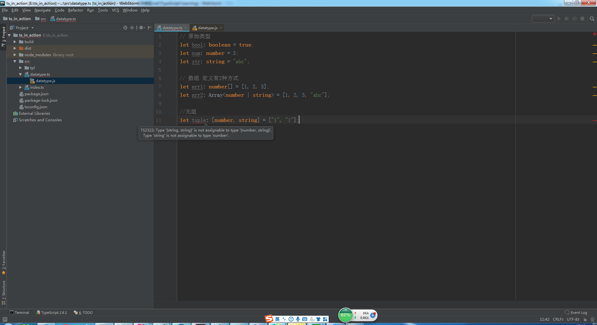
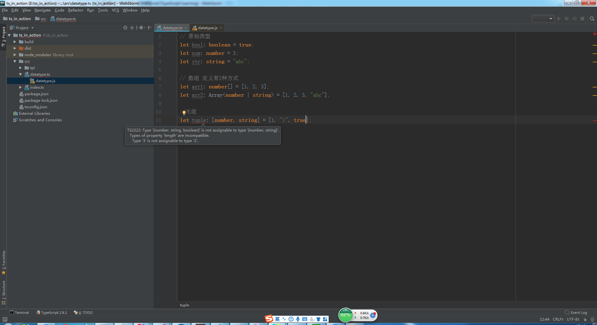
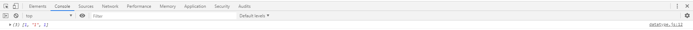

# 基本类型

> 知识大纲

1. ES6的数据类型
    * Boolean
    * Number
    * String
    * Array
    * Function
    * Object
    * Symbol
    * undefined
    * null
2. TypeScript的数据类型
    * Boolean
    * Number
    * String
    * Array
    * Function
    * Object
    * Symbol
    * undefined
    * null
    * **void**
    * **any**
    * **never**
    * **元组**
    * **枚举**
    * **高级类型**
3. TS多了几个类型，就是上述加粗的类型分别是void，any，never，元组，枚举，高级类型
4. 类型注解
    1. 作用: 相当于强类型语言中的类型声明
    2. 语法: (变量/函数): type 
    
> 练习

1. 我们在上次的项目中，src下新建一个**datatype.ts**  
2. 在index.ts中把它引入进来，代码是`import './datatype'`
3. 我们现在可以在datatype.ts愉快的编写代码了
    1. 原始类型
        1. 具体代码如下
            ```
            // 原始类型
            let bool: boolean = true;
            let num: number = 3;
            let str: string = "abc";
            ```   
        2. 如果我们为字符串类型str赋值个数字会怎么样？编辑器会报错
        
             
            
        3. 但我们的js文件还是照样生成了
        
            
            
        4. 这里就能体会出来ts和js的区别，ts的变量类型是不可以被改变的(强类型)
        
    2. 数组
        1. 具体代码如下 
            ```
            // 数组 定义有2种方式
            let arr1: number[] = [1, 2, 3];
            let arr2: Array<number> = [1, 2, 3];
            ```       
        2. 这2种定义是等价的，意思是我们的数组里的元素必须是number类型
        3. 我们可以为其中一个数组添加个字符串成员看下会怎么样？编辑器还是会报错
        
             
            
        4. 我们可以使用这样一个语法，让数组既可以支持数字，又可以支持字符串 
        
            * `let arr2: Array<number | string> = [1, 2, 3, "abc"];`   
            * 这样我们里面的元素就可以可以是数字也可以是字符串啦，任性~   
    3. 元组
        1. 元组是特殊的数组，它规定了数组的类型和长度
        2. 具体代码如下   
            ```
            //元组
            let tuple: [number, string] = [1, "1"];
            ```
        3. 比方说我们把第一个数字的1改成字符串看下，历史继续重演   
        
            
            
        4. 我们恢复下现场，给元组添加个元素
        
             
            
        5. 越界问题
            * 元组可以像数组一样push元素，我们发现push元素ts编译并没有报错，
                而且可以在浏览器控制台看到信息
            
                
                
                
                
            * 然后我们去用下标访问下添加的元素，发现也没有报错
                
                
                
        6. 但不建议这么使用，元组就是规定了数组的长度和类型        
                   
            
                