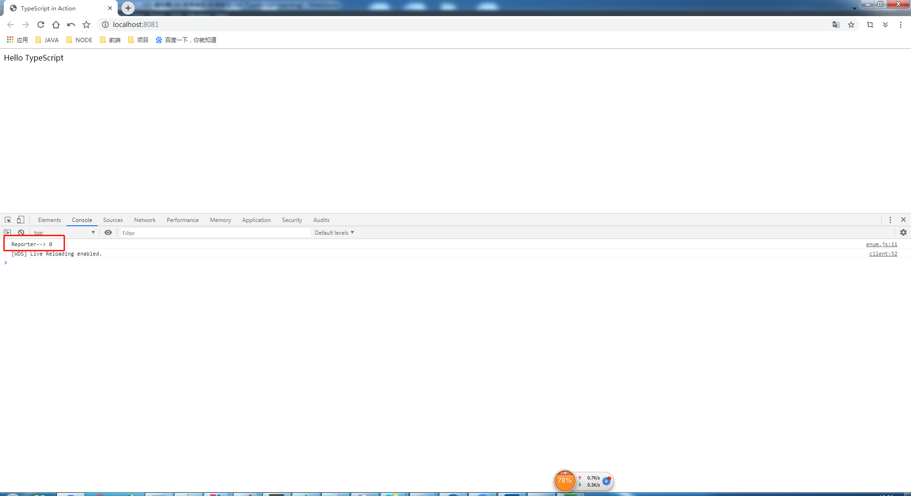
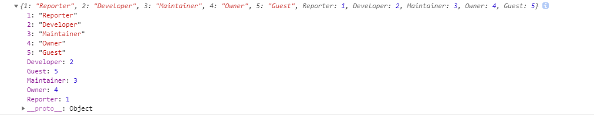

# 枚举类型

> 知识大纲
1. 我们先来看一段代码
    ```
    function initRole(role){
        if(role === 1 || role === 2){
            //do sth
        }else if(role === 3 || role === 4){
            //do sth
        }else if(role == 5){
            //do sth
        }else{
            //do sth
        }
    }
    ```
2. 很明显这段代码的问题有这么几个
    1. 可读性比较差
        * 如果没有对应的文档，根本记不住这些数字代表的是什么角色
    2. 可维护性比较差
        * 硬编码，牵一发动全身
3. 如何解决这个问题，我们就可以使用ts中的枚举类型
4. 枚举是一组有名字的常量集合
    * 你可以把他理解成手机的通讯录
    * 你拨打电话的时候不用记住电话号码，只要记住人名就可以了
    * 况且电话号码是可以变的，人名大多数情况下是不会变的，只要编辑这个人的电话号码就可以了
5. 枚举类型分为
    1. 数字枚举
    2. 字符串枚举
    
> 练习
1. 我们依旧在我们之前的项目中，src下新建一个enum.ts,然后在index中引用  
2. 数字枚举
    * 具体代码如下
        ```
        // 数字枚举
        enum Role{
            Reporter,
            Developer,
            Maintainer,
            Owner,
            Guest
        }
        
        console.log("Reporter--> " + Role.Reporter);
        ```                   
    * 然后我们就能看到控制台打印了这个  
    
          
        
    * 所以后面的枚举成员，数字就是递增的，就是1，2，3，4...
    * 除此之外我们还可以自定义枚举成员的值  
        ```
        // 数字枚举
        enum Role{
            Reporter = 1,
            Developer,
            Maintainer,
            Owner,
            Guest
        }
        
        console.log("Reporter--> " + Role.Reporter);
        console.log("Developer--> " + Role.Developer);
        console.log("Maintainer--> " + Role.Maintainer);
        console.log("Owner--> " + Role.Owner);
        console.log("Guest--> " + Role.Guest);
        ```  
    * 然后在来看下控制台，说明我们自定义后，枚举成员后面的递增依然有效   
    
         
        
    * 我们发现，枚举很像一个对象，这次我们就直接来打印下Role看下结果  
        * 代码就很简单的一句话`console.log(Role)`  
        * 控制台的结果是
            
            
        
        * 很明显我们可以通过索引来查找，也可以通过定义的枚举成员来查找索引
        * 我们还可以看下是如何实现的，我们来看一下enum.js
            ```
            "use strict";
            // 数字枚举
            var Role;
            (function (Role) {
                Role[Role["Reporter"] = 1] = "Reporter";
                Role[Role["Developer"] = 2] = "Developer";
                Role[Role["Maintainer"] = 3] = "Maintainer";
                Role[Role["Owner"] = 4] = "Owner";
                Role[Role["Guest"] = 5] = "Guest";
            })(Role || (Role = {}));
            console.log("Reporter--> " + Role.Reporter);
            console.log("Developer--> " + Role.Developer);
            console.log("Maintainer--> " + Role.Maintainer);
            console.log("Owner--> " + Role.Owner);
            console.log("Guest--> " + Role.Guest);
            console.log(Role);
            console.log(Role[2]);
            ```
        * `Role["Reporter"] = 1` 这个就是很明显把**Reporter**当成key，value为1，同时这个表达式返回的结果就是1
        * 所以`Role[Role["Reporter"] = 1] = "Reporter";` 又可以把索引当成key，所以能通过数字找到对应的**Reporter**
        * 所以结果就是
            1. 我们可以通过**Role["Reporter"]**或者**Role.Reporter**去查找索引，这个结果就是1
            2. 我们也可以通过**Role[1]**，用索引去查找，这个结果就是Reporter
            3. 原理也非常简单，希望各位小伙伴能看懂实现的原理
        * 这个实现的方式应该就是叫反向映射(如果不对希望大佬轻喷，并且纠正~)
3. 字符串枚举        