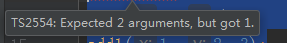
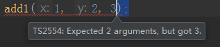

# 函数相关知识点梳理

> 练习
1. 如何定义个函数
    1. 代码如下
        ```
        function add1(x: number, y: number){
            return x + y;
        }
        
        let add2: (x: number, y: number) => number;
        
        type add3 = (x: number, y: number) => number;
        
        interface add4 {
            (x: number, y: number): number
        }
        ```
    2. 后3种只是定义，没有具体的实现

2. ts对函数参数的要求限制
    1. 在js中，对参数是没有要求的
    2. 在ts中，形参实参必须一一对应
    3. 比方说我们调用第一个方法add1
        ```
        add1(1);
        add1(1, 2);
        add1(1, 2, 3);
        ```        
    4. 我们会发现，1个参数和3个参数的都报错了
        
         
        
        
        
    5. 有时候我们参数是可选的，我们可以这样处理
        1. 代码如下，y的参数可以不传的    
            ```
            function add5(x: number, y?: number) {
                return y ? x + y : x;
            }
            
            add5(1, 2);
            add5(10);
            ```   
        2. 注意，可选参数必须在必选参数之后
        3. 我们调戏下，在可选参数之后写个必选参数，就能看到编辑器报错了   
        
             
    
    6. 我们也可以像es6这样，给参数个默认值 
        1. 代码如下
            ```
            function add6(a: number, b = 0, c: number, d = 1) {
                return a + b + c + d;
            }
            
            console.log(add6(1, undefined, 3));
            ```       
        2. 注意，默认值放在中间的要传undefined
        
    7. 剩余参数的使用(参数不固定的时候)
        * 代码如下
            ```
            function add7(x: number, ...rest: number[]){
                return x + rest.reduce((a, b) => a + b);
            }
            
            console.log(add7(1, 2, 3, 4, 5, 6, 7, 8));
            ```        
    8. 函数重载
        1. 在静态类型语言中，如java，函数是有重载的
        2. 在ts中使用上有些区别，要先定义一系列的声明 
            ```
            function add8(...rest: number[]): number;
            function add8(...rest: string[]): string;
            ```      
        3. 实现重载
            ```
            function add8(...rest: any[]): any {
                let first = rest[0];
                if (typeof first === "string") {
                    return rest.join("");
                }
                if (typeof first === "number") {
                    return rest.reduce((x, y) => x + y);
                }
            }
            
            console.log(add8(1, 2, 3, 4, 5));
            console.log(add8("a", "b", "c"));
            ```    
        
> 目录

* [返回目录](../../README.md)        