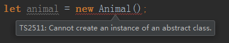

# 类-抽象类与多态

> 知识大纲
* 抽象类是ts的扩展
* 只能被继承，不能被实例化
* 多态-简单的说就是父类的抽象方法，子类有多种不同的实现方式

> 练习
1. 抽象类
    * 我们先定义个抽象类，代码如下
        ```
        abstract class Animal{
            
        }
        ```
    * 如果我们实例化Animal,`let animal = new Animal();`就会看到报错了
    
        
        
    * 抽象类只能被继承，我们可以把之前的Dog继承下Animal
        * 因为继承，所以不要忘记在构造函数里调用`super()`，否则会报错
        * 代码如下        
            ```
            abstract class Animal{
            
            }
            class Dog extends Animal{
                constructor(name: string){
                    super();
                    this.name = name;
                }
                public name: string;
                run(){
            
                }
                private pri(){}
                protected pro(){}
                readonly legs: number = 4;
                static food: string = "bones";
            }
            ```
    * 在抽象类中我们可以实现个方法   
        ```
        abstract class Animal{
            eat(){
                console.log("eat");
            }
        }
        ``` 
    * 然后在子类的实例可以调用这个方法，比如`dog.eat()`;

2. 多态    
    * 在抽象类中也可以定义个抽象方法，需要子类去实现
    * 抽象方法的好处就是，你知道子类有不一样的实现，就不需要在父类里实现了，具体代码如下
        ```
        abstract class Animal{
            eat(){
                console.log("eat");
            }
            abstract sleep(): void;
        }
        ```    
    * 然后记得子类实现这个方法，这里你可以脑补不一样的动物睡觉方式是不一样的，这就是多态
    * 我们可以在写个Cat去继承Animal，然后实现Cat的sleep方法
        ```
        class Cat extends Animal{
            sleep(){
                console.log("cat sleep");
            }
        }
        
        let cat = new Cat();
        let animals: Animal[] = [dog, cat];
        animals.forEach(item => item.sleep());
        ```        
        
3. 补充，方法的链式调用
    1. 我们先新建个类，具体代码如下
        ```
        class WorkFlow{
            step1(){
                return this;
            }
            step2(){
                return this;
            }
        }
        ```   
    2. 因为方法都返回了实例this，所以我们可以链式调用,具体代码如下
        ```
        new WorkFlow().step1().step2();
        ```    
    3. 我们在定义个WorkFlow的子类
        ```
        class MyFlow extends WorkFlow{
            next(){
                return this;
            }
        }
        ```    
    4. 我们可以花式调用子类和父类的方法   
        ```
        new MyFlow().next().step1().next().step2();       
        ```     

> 目录

* [返回目录](../../README.md)        