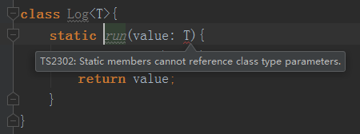
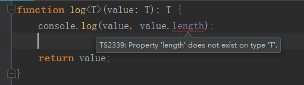

# 泛型-泛型类与泛型约束

> 练习
1. 泛型类
    1. 定义一个泛型类
        ```typescript
        class Log<T>{
            run(value: T){
                console.log(value);
                return value;
            }
        }
        ```
        
    2. 泛型不能用在一个类的静态成员，如果我们在run方法前面写个static就会报错
    
        
        
    3. 然后我们实例化下
        ```typescript
        class Log<T>{
            run(value: T){
                console.log(value);
                return value;
            }
        }
        let log1 = new Log<number>();
        log1.run(1);
        let log2 = new Log(); 
        log2.run({a: 1}); // 因为log2没有指定类型，所以可以传入任意的值
        ```    
        
2. 泛型约束   
    1. 我们先来改造下之前的log函数,比如我们还要打印出一个对象的长度，显然这个是会报错的
    
        
        
    2. 这个时候我们就要写个接口来约束下
        ```typescript
        interface Length{
            length: number
        }
        function log<T extends Length>(value: T): T {
            console.log(value, value.length);
        
            return value;
        }
        log([1,2,3]);
        log("123");
        log({length: 1});
        ```    
        
    3. 通过泛型继承了Length这个接口，约束了传入的参数必须要有length这个属性
    
3. 泛型的好处
    1. 函数和类可以轻松地支持多种类型，增强程序的扩展性
    2. 不必写多条函数重载，冗长的联合类型声明，增强代码可读性
    3. 灵活控制类型之间的约束 

> 目录

* [返回目录](../../README.md)           
  
    