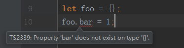
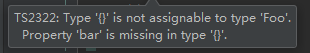

# 类型检查机制-类型推断

> 知识大纲
* TypeScript编译器在做类型检查时，所秉承的一些原则，以及表现出的一些行为。
* 作用: 辅助开发，提高开发效率
* 类型推断指的是不需要指定变量的类型(函数的返回值类型)，TypeScript可以根据某些规则自动地
    为其推断出一个类型
    1. 基础类型推断
    2. 最佳通用类型推断
    3. 上下文推断

> 练习
1. 基础类型推断&最佳通用类型推断
    * 代码如下
        ```typescript
        let a = 1;
        let b = [1, "1"];
        let c = (x = 1) => x + 1;
        ```
    * 以上代码，ts编译器会推断出其基础
        1. a是number (基础类型推断)
        2. b是Array<number | string> (最佳通用类型推断)
        3. c是函数，函数返回值类型是number (最佳通用类型推断)
    * 以上推断基本是从右往左推断，根据赋值的内容推断
    
2. 上下文推断
    * 代码如下
        ```
        window.onkeydown = (event) => {
            console.log(event);
        };
        ```          
    * ts根据上下文，会推断出event是个键盘事件    
    
3. 有时候ts推断的并不准确，毕竟只有你自己才最懂自己的代码，这个时候该如何做
    * ts允许你可以类型断言，类型断言就是手动指定个类型
    * 之前我们学习中其实用到过，这边在复习下
    * 我们先写个对象，然后任意给它个属性，众所周知这个是会报错的
    
        
    
    * 如何解决，我们可以定义个接口，代码如下
        ```typescript
        interface Foo{
            bar: number
        }
        let foo = {} as Foo;
        foo.bar = 1;
        ```    
    * 上面的代码就不会报错了，我们使用了类型断言**as Foo**   
    * 类型断言有时候也不能乱用
        1. 我们把`foo.bar = 1`这行代码注释掉
        2. 这个时候发现ts并没有报错，但实际上规范上是必须要有bar这个属性的，所以是不合规的
        3. 这就是不能乱用断言的原因
        4. 解决方案可以在声明的时候就制定它的类型
            ```
            interface Foo{
                bar: number
            }
            let foo: Foo = {
                bar: 1
            };
            ``` 
        5. 如果这里没有写**bar: 1**,ts就会给我们报错了，缺少bar属性 
        
               

> 目录

* [返回目录](../../README.md)            