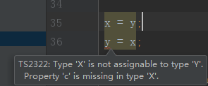
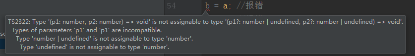
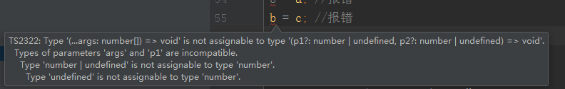
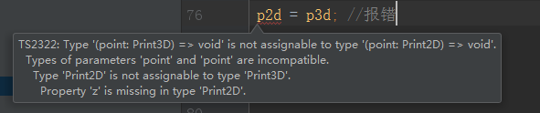
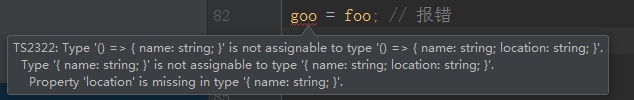
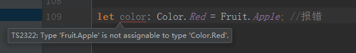

# 类型检查机制-类型兼容性

> 知识大纲
* 当一个类型Y可以被赋值给另一个类型X时，我们就可以说类型X兼容类型Y
    * X兼容Y: X(目标类型) = Y(源类型)
* 增加语言的灵活性
* 口诀    
    1. 结构之间的兼容: 成员少的兼容成员多的 
    2. 函数之间的兼容: 参数多的兼容参数少的

> 练习
1. 热身
    1. 先来看这么一段代码
        ```typescript
        let s: string = "a";
        s = null;
        ```
    2. 这段代码在默认的情况下是会报错的，因为我们s说了是字符串类型，但你之后又把null赋值给s
    3. 我们可以修改配置，打开`"strictNullChecks": false,`那就不会报错了
    4. 这个时候我们就可以说字符型是兼容null类型的    

2. 接口兼容    
    1. 我们先定义2个接口 
        ```typescript
        interface X {
            a: any,
            b: any,
        }
        
        interface Y {
            a: any,
            b: any,
            c: any,
        }
 
        let x: X = {a: 1, b: 2};
        let y: Y = {a: 1, b: 2, c: 3};
        x = y;
        //y = x; //报错
        ```   
    2. 然后我们玩下赋值，发现y是可以赋值给x的，但x不能赋值给y(因为y里接口定义有c，x里没有c)  
    3. 报错信息如下
        
        
        
    4. 总结就是，接口间的兼容，成员多的可以赋值给成员少的
 
3. 函数兼容，兼容有3个方面  
    1. 参数个数
        1. 先上代码
            ```typescript
            type Handle = (a: number, b: number) => void;
            function fn(handle: Handle){
                return handle;
            }
            ```
        2. 这里的Handle就是目标类型，传入的参数就是源类型
        3. 然后我们写2个handle函数
            1. 代码如下
                ```typescript
                type Handle = (a: number, b: number) => void;
                function fn(handle: Handle){
                    return handle;
                }
                //
                let handle1 = (a: number) => {};
                fn(handle1);
                let handle2 = (a: number, b: number, c: number) => {}; 
                // fn(handle2); //报错，因为你平白无故多了个c
                ```
            2. 报错信息如下
                
                报错.jpg)
                     
        4. 可选参数和剩余参数的例子
            ```typescript
            let a = (p1: number, p2: number) => {}; //固定参数
            let b = (p1?: number, p2?: number) => {}; //可选参数
            let c = (...args: number[]) => {}; //剩余参数
            a = b;
            a = c;
            // b = a; //报错
            // b = c; //报错
            c = a;
            c = b;
            ```    
        5. 我们可以互相赋值看下结果
            1. a能兼容b，a也可以兼容c
            2. b不兼容a，b也不兼容c
            3. c可以兼容a，c也可以兼容b
            4. 报错图片如下
            
                
                
                
        
    2. 参数类型
        1. 先看代码
            ```typescript
            type Handle = (a: number, b: number) => void;
            function fn(handle: Handle){
                return handle;
            }
            let handle3 = (a: string) => {};
            // fn(handle3);  //报错因为类型不兼容
            ```    
            
            报错.jpg)
            
        2. 再来看段代码
            ```typescript
            interface Print3D {
                x: number;
                y: number;
                z: number;
            }
            
            interface Print2D {
                x: number;
                y: number;
            }
            
            let p3d = (point: Print3D) => {};
            let p2d = (point: Print2D) => {};
            p3d = p2d;
            // p2d = p3d; //报错
            ```
        3. 上述代码测试下来是和之前的接口相反的
            
            
            
    3. 返回值类型
        1. 先看代码
            ```typescript
            let foo = () => ({name: "Alice"});
            let goo = () => ({name: "Alice", location: "Shanghai"});
            
            foo = goo;
            // goo = foo; // 报错
            ```       
        2. 报错如下
            
                
            
        3. 我们在来看下函数的重载
            ```typescript
            function overload(a: number, b: number): number;
            function overload(a: string, b: string): string;
            function overload(a: any, b: any): any{}
            ```    
        4. 函数重载分为2个部分
            1. 列表中的函数 -> 目标函数(这里指的就是number和string返回值的函数)
            2. 实现的函数 -> 源函数(这里指的就是any返回值的那个实现的函数)
            3. 我们把实现的函数返回值any去掉就会报错 

4. 枚举兼容
    1. 先看这段代码
        ```typescript
        enum Fruit {Apple, Banana}
        
        enum Color {Red, Yellow}
        
        let fruit: Fruit.Apple = 3;
        let no: number = Fruit.Apple;
        
        // let color: Color.Red = Fruit.Apple; //报错
        ```
    2. 上述代码说明
        1. 枚举和数字是可以互相兼容的
        2. 枚举之间不互相兼容 
        
    3. 报错信息
    
            
    
5. 类兼容
    1. 先上代码
        ```typescript
        class A {
            constructor(p: number, q: number) {
            }
        
            id: number = 1;
        }
        
        class B {
            static s = 1;
        
            constructor(p: number) {
            }
        
            id: number = 2;
        }
        
        let aa = new A(1, 2);
        let bb = new B(1)
        aa == bb;
        bb == aa;
        ```     
        
    2. 这里要注意一点，2个类的兼容，静态成员和构造函数是不比较的  
    3. 上述代码中，两个类的实例是互相兼容的
    4. 我们给他们加上私有成员在看下结果，代码如下
        ```typescript
        class A {
            constructor(p: number, q: number) {
            }
        
            id: number = 1;
            
            private name:string = "aa";
        }
        
        class B {
            static s = 1;
        
            constructor(p: number) {
            }
        
            id: number = 2;
     
            private name:string = "bb";
        }
        
        let aa = new A(1, 2);
        let bb = new B(1);
        
        // aa == bb; //加上私有成员后报错
        // bb == aa; //加上私有成员后报错
        ```                  
    5. 这种情况父类和子类是可以兼容的，我们来定义一个A的子类C，在创建下C的实例
        ```typescript
        class A {
            constructor(p: number, q: number) {
            }
        
            id: number = 1;
        
            private name:string = "aa";
        }
        class C extends A{}
        let aa = new A(1, 2);
        let cc = new C(3, 4);
        aa = cc;
        cc = aa;
        ```    
        
6. 泛型兼容
    1. 先来看下泛型接口
        ```typescript
        interface Empty<T> {
            
        }
        
        let obj1: Empty<number> = {};
        let obj2: Empty<string> = {};
        
        obj1 = obj2;
        ```   
    2. 现在是兼容的，因为我们泛型里没有任何成员，我们现在加个成员再试下   
        ```typescript
        interface Empty<T> {
            value: T;
        }
        
        let obj1: Empty<number> = {value: 1};
        let obj2: Empty<string> = {value: '1'};
        
        // obj1 = obj2; //报错，不兼容
        // obj2 = obj1; //报错，不兼容
        ```
    3. 再来看下泛型函数
        ```typescript
        let log1 = <T>(x: T): T => {
            console.log("x");
            return x;
        };
        
        let log2 = <U>(y: U): U => {
            console.log("y");
            return y;
        };
        
        log1 == log2;      
        ```    
    4. 也就是说，如果2个泛型函数的定义相同，但没有指定类型参数，他们也是兼容的    
              