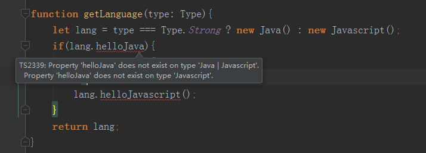

# 类型检查机制-类型保护

> 知识大纲
1. TypeScript能够在特定的区块中保证变量属于某种确定的类型
2. 可以在此区块中放心的引用此类型的属性，或者调用此类型的方法

> 练习
1. 先来看个例子
    ```typescript
    enum Type{Strong, Week};
    
    class Java{
        helloJava(){
            console.log("Hello Java");
        }
        java: any;
    }
    
    class Javascript{
        helloJavascript(){
            console.log("Hello Javascript");
        }
        javascript: any;
    }
    
    function getLanguage(type: Type){
        let lang = type === Type.Strong ? new Java() : new Javascript();
        return lang;
    }
    
    getLanguage(Type.Strong);
    ```
    
2. 比方说我们要在getLanguage方法中，调用hello的方法，于是就这么写
    * 代码如下
        ```
        function getLanguage(type: Type){
            let lang = type === Type.Strong ? new Java() : new Javascript();
            if(lang.helloJava){
                lang.helloJava();
            }else{
                lang.helloJavascript();
            }
            return lang;
        }
        ```
    * 然后ts就报错啦，因为它不能精确的判断lang是哪一种类的实例  
    
        
        
    * 所以我们要加上类型断言,这样就不会报错了，但这不是理想的方案 
        ```
        function getLanguage(type: Type){
            let lang = type === Type.Strong ? new Java() : new Javascript();
            if((lang as Java).helloJava){
                (lang as Java).helloJava();
            }else{
                (lang as Javascript).helloJavascript();
            }
            return lang;
        }
        ``` 
3. 所以要使用类型保护，一共有4种方式
    1. 使用 instanceof
        ```
        if(lang instanceof Java){
            lang.helloJava();
        }else{
            lang.helloJavascript();
        }
        ```
    2. 使用 in
        ```
        if('java' in lang){
            lang.helloJava();
        }else{
            lang.helloJavascript();
        }
        ```
    3. 使用 typeof, 注意这里的typeof判断基本类型，我们给函数参数多传一个x来模拟
        ```
        function getLanguage(type: Type, x: string | number){
            let lang = type === Type.Strong ? new Java() : new Javascript();
            // if((lang as Java).helloJava){
            //     (lang as Java).helloJava();
            // }else{
            //     (lang as Javascript).helloJavascript();
            // }
            // if(lang instanceof Java){
            //     lang.helloJava();
            // }else{
            //     lang.helloJavascript();
            // }
            // if('java' in lang){
            //     lang.helloJava();
            // }else{
            //     lang.helloJavascript();
            // }
            if(typeof x === "string"){
                //字符串都有length
                console.log(x.length);
            }else{
                //可以调用数字型的方法
                x.toFixed();
            }
            return lang;
        }
        ```
    4. 创建一个类型保护函数，来判断对象的类型   
        1. 先要自定义一个类型保护函数，这里的返回值比较特殊，并且函数体内也要使用类型断言
            ```
            function isJava(lang: Java | Javascript): lang is Java{
                return (lang as Java).helloJava !== undefined
            }
            ```  
        2. 然后就可以在前面的getLanguage里追加逻辑
            ```
            if(isJava(lang)){
                lang.helloJava();
            }else{
                lang.helloJavascript();
            }    
            ```    
        
        
               