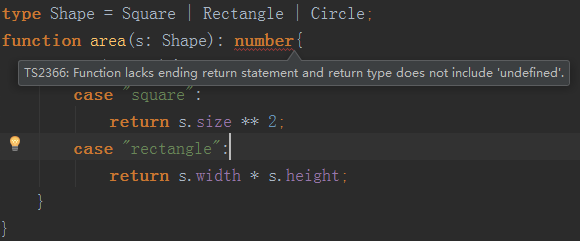
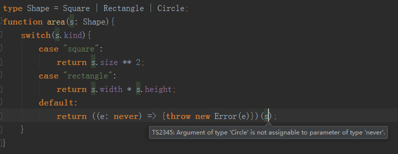

# 高级类型-交叉类型与联合类型

> 知识大纲

* 高级类型是ts为了保障语言的灵活性，引用的一些语言的特性

> 练习
1. 交叉类型
    1. 先来看下代码
        ```typescript
        interface DogInterface {
            run(): void;
        }
        
        interface CatInterface{
            jump(): void;
        }
        
        let pet: DogInterface & CatInterface = {
            run(){
                
            },
            jump(){
                
            }
        };
        ```
    2. 上述代码,pet用的就是交叉类型，需要注意的是，有意思的地方就是虽然这叫交叉类型，但实际上使用的是两个接口的并集，
        pet必须实现2个接口的所有方法，否则会报错
                
2. 联合类型
    1. 我们之前其实用过很多次了，所谓联合类型，就是声明的类型并不确定，可以为多个类型中的一个
    2. 来看代码
        ```typescript
        let aaa: number | string = "1";
        let bbb: "a" | "b" | "c";
        let ccc: 1 | 2 | 3;
        ```
    3. 代码解说
        1. aaa可以是number也可以是string，我们初始化给它个字符串"1"
        2. bbb只能是"a","b","c"三种情况的一种
        3. ccc道理同上
    4. 我们在看下类的联合类型
        ```
        class Dog implements DogInterface{
            run(){};
            eat(){};
        }
        
        class Cat implements CatInterface{
            jump(){};
            eat(){};
        }
        
        enum Master{Boy, Girl}
        
        function getPet(master: Master){
            let pet = master == Master.Boy ? new Dog() : new Cat();
            pet.eat();
            return pet;
        }
        ``` 
    5. 上述代码中，`pet.eat()`就是联合类型(ide会自动提示，可以调用eat但没有提示run或者jump)，
        如果想访问其中的一个方法，就要用我们之前学的类型保护，这里又会发现这个有意思的现象，
        虽然这个叫联合类型，但实际上取得是交集
        
    6. 可区分的联合类型
        1. 国际惯例先上代码
            ```typescript
            interface Square{
                kind: "square";
                size: number;
            }
            
            interface Rectangle{
                kind: "rectangle";
                width: number;
                height: number;
            }
            
            type Shape = Square | Rectangle;
            function area(s: Shape){
                switch(s.kind){
                    case "square": 
                        return s.size ** 2;
                    case "rectangle":
                        return s.width * s.height;
                }
            }
            ```    
        2. 如果我们要加个新的形状，比如圆
            ```
            interface Circle{
                kind: "circle",
                r: number
            }
            
            type Shape = Square | Rectangle | Circle;
            ```    
        3. 这个时候我们会发现，我们新加了个形状，并且在shape中也加上了Circle，
            但没有在计算面积的函数里增加圆面积的计算公式，函数也没有报错，
            下面就是要说如何用ts去约束这种模式呢(即给出相应的错误提示)，有2种方式
            1. 给函数个明确的返回值
                * 比如函数返回值给个number，因为circle的计算公式没写，函数这个时候的返回值会是undefined
                * 下面我就加上了number的返回值类型，然后我们看下报错信息
                
                    
                    
            2. 在default中自执行个函数
                * 具体代码如下
                    ```
                    default: 
                        return ((e: never) => {throw new Error(e)})(s); 
                    ```     
                * 这个时候也有报错，代码解读下
                    * 原理就是检查s是不是never类型
                    * 因为你没有写对应的case，circle可不是never类型，自然而然就会报错
                    * 如果没有遗漏，永远不会走到default这个分支
                    * 报错信息如下
                        
                          
            
                * 最终代码可以这么写
                    ```
                    function area(s: Shape){
                        switch(s.kind){
                            case "square":
                                return s.size ** 2;
                            case "rectangle":
                                return s.width * s.height;
                            case "circle":
                                return Math.PI * (s.r ** 2);
                            default:
                                return ((e: never) => {throw new Error(e)})(s);
                        }
                    }
                    ```                         
            