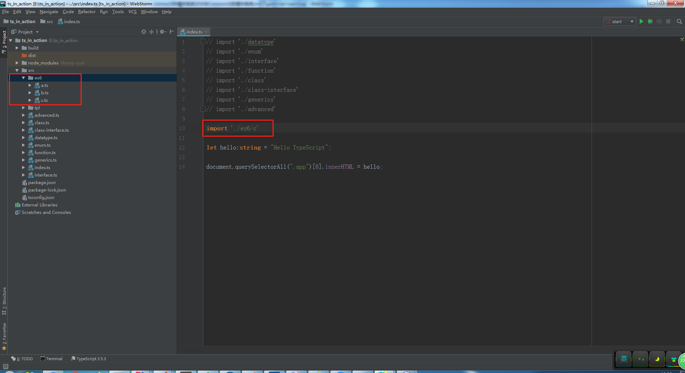
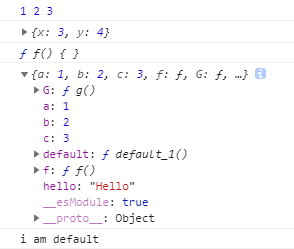
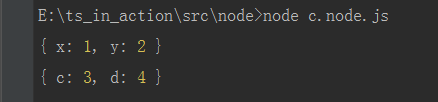
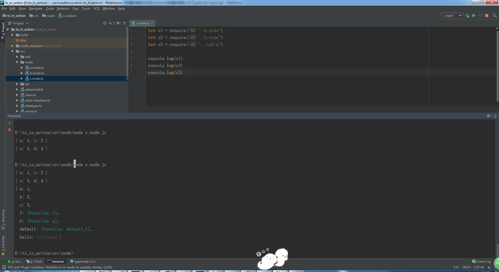

# ES6与CommonJS的模块系统

> 知识大纲

1. ES6的模块系统
2. CommonJS的模块系统

> 练习
1. ES6的模块系统
    1. 在src下新建一个文件夹es6
    2. 里面分别有3个模块(ts文件)，分别是a,b,c
    3. 他们之间的依赖关系是c依赖a，a依赖b
    4. 为了看出最后的执行效果，我们在index中，import的模块是c
    
        
        
    5. a.ts的代码
        ```
        // 单独导出
        export let a = 1;
        
        //批量导出
        let b = 2;
        let c = 3;
        export {b, c};
        
        //导出接口
        export interface P {
            x: number,
            y: number
        }
        
        // 导出函数
        export function f(){}
        
        //导出时起别名
        function g(){}
        export {g as G};
        
        //默认导出,无需函数名
        export default function(){
            console.log("i am default");
        }
        
        //引入外部模块，重新导出
        export {str as hello} from './b';

        ```
    6. b.ts的代码
        ```typescript
        export const str = "Hello";
        ```    
        
    7. c.ts的代码
        ```
        import {a, b, c} from './a'; //批量导入
        import { P } from './a'; //导入接口
        import {f as F} from "./a"; //导入函数
        import * as All from "./a"; //导入模块中所有成员，绑定在All上
        import myFunction from "./a"; //不加{}，导入默认的
        
        console.log(a, b, c);
        let p: P = {
            x: 3,
            y: 4
        };
        console.log(p);
        console.log(F);
        console.log(All);
        
        myFunction();
        ```    
    8. 控制台信息
    
        
        
2. CommonJS的模块系统
    1. 在src下新建一个文件夹node
    2. 里面分别有3个模块(ts文件)，分别是a.node,b.node,c.node 
    3. 他们之间的依赖关系是c依赖了a和b
    4. a.node的代码
        ```
        let a = {
            x: 1,
            y: 2
        };
        // 整体导出
        module.exports = a;
        
        export {} //解决报错问题
        ```    
    5. b.node的代码
        ```
        //导出多个变量
        exports.c = 3;
        exports.d = 4;
        ```   
    6. c.node的代码
        ```
        let c1 = require("./a.node");
        let c2 = require("./b.node");
        
        console.log(c1);
        console.log(c2);
        ```    
    7. 用node命令执行
    
         
        
3. 编译的选项(tsconfig.json)
    1. target
        * 编译成的目标语言是什么版本
        * 默认是es3
        * tsc -t指令可以无视配置文件，-t就是target的缩写
        * 例如,**tsc xxxxxx.ts -t es5**
    2. module
        * 要编译成怎样的模块系统
        * 默认是CommonJs
        * tsc -m, -m是module的缩写                 
        * 例如,**tsc xxxxxx.ts -m amd**
    3. 通常我们都是使用默认的配置 
    4. 两个模块系统的兼容问题  
        * 可以先去看下编译后的js文件
        * 这里举个例子，我们在c.node.ts中引用es6的a.ts,然后执行node命令
        
            
            
        * 所以我们要执行default必须要用**c3.default();**，而不能直接**c3()**;
        * 如何解决这个问题
            * 第一种方法，两个模块不要混用
            * 第二种方法，使用全新语法
                1. 我们在es6文件夹中新建一个d.ts
                2. 编写代码
                    ```
                    export = function(){
                        console.log("i am default");
                    }
                    
                    // export let a = 1; //这个是会报错的
                    ```    
                3. 在回到c.node.ts    
                    ```
                    let c1 = require("./a.node");
                    let c2 = require("./b.node");
                    let c3 = require("../es6/a");
                    import c4 = require("../es6/d");
                    
                    console.log(c1);
                    console.log(c2);
                    console.log(c3);
                    
                    c3.default();
                    c4();
                    ```
                4. 然后运行node命令，我们就会发现c4()的语法就能打印出我们想要的结果了
                5. 还可以这么使用**import c4 from '../es6/d';**，2种导入方式都可以
                6. 我们再去看下配置文件，有这么个属性**esModuleInterop**，这个默认是true，
                    因为这个配置项，所以我们2种导入方式都可以
                7. 如果把这个改成false，就会报错  
            * 建议是两个模块不要混用   

> 目录

* [返回目录](../../README.md)               