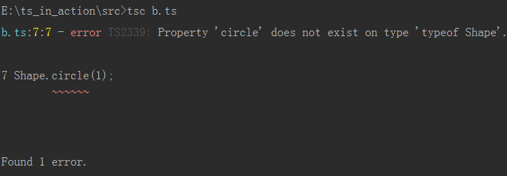
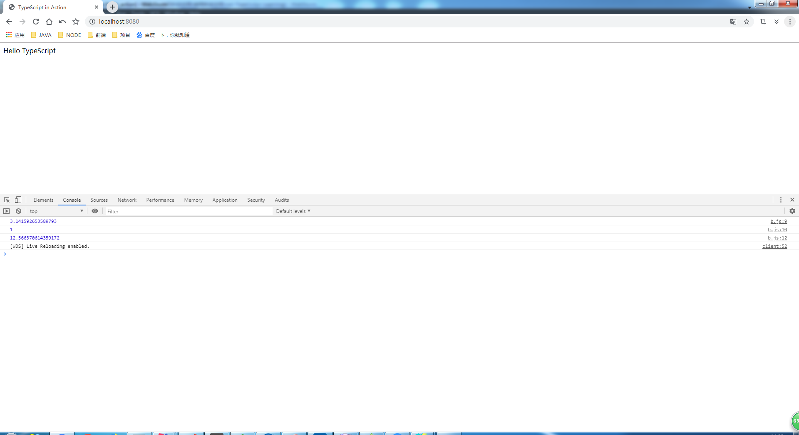

# 使用命名空间

* 关键字 - namespace

> 练习
1. 在src下新建2个ts文件，**a.ts**和**b.ts**

2. a.ts的代码如下
    ```typescript
    namespace Shape{
        const pi = Math.PI;
        export function circle(r: number){
            return pi * r ** 2;
        }
    }
    ```
    
3. b.ts的代码如下 
    ```typescript
    namespace Shape{
        export function square(x: number){
            return x ** 2;
        }
    }
    ```    
    
4. 很明显命名空间是可以拆分的，所以Shape命名空间在2个文件中，这2个文件是共享一个命名空间的

5. 然后我们在b.ts中调用circle和square方法
    ```
    namespace Shape{
        export function square(x: number){
            return x ** 2;
        }
    }
    
    Shape.circle(1);
    Shape.square(1);
    ```    
    
6. 这里需要注意，命名空间不和模块混用，我们如何使用这个命名空间，命名空间最好在一个全局的环境中使用，
    一般先把这2个文件编译成js文件，在index.html通过script标签引用
    
7. 编译时发现的错误
    * 我们使用tsc命令
    * 编译a.ts的时候发现没有任何问题
    * 编译b.ts时报错了
    
        
        
8. 如何解决这个问题
    * 这个报错是因为circle方法是在a.ts中定义的，我们在b中直接使用circle方法才导致了报错
    * 所以我们要引用a.ts，要使用3斜线指令，最终代码如下
        ```
        /// <reference path="a.ts" />
        namespace Shape{
            export function square(x: number){
                return x ** 2;
            }
        }
        
        Shape.circle(1);
        Shape.square(1);
        ```        
    * 然后在tsc编译下看下有没有报错，这个时候编译就通过了没任何问题
    
9. 我们可以看下a.js和b.js的源码，可以了解下命名空间是如何实现的
    1. js如何实现命名空间
        ```javascript
        var Shape;
        (function (Shape) {
            var pi = Math.PI;
            function circle(r) {
                return pi * Math.pow(r, 2);
            }
            Shape.circle = circle;
        })(Shape || (Shape = {}));
        ```        
    2. 从代码中可以发现，自执行，然后最后把方法赋值给Shape的circle属性上，这个就是实现的原理

10. 现在我们就把编译好的js文件在index页面中通过script标签引用,还有不要忘记在b.ts中打印出结果  
    ```html
    <!DOCTYPE html>
    <html lang="en">
    <head>
        <meta charset="UTF-8">
        <title>TypeScript in Action</title>
    </head>
    <body>
        <div class="app"></div>
        <script src="src/a.js"></script>
        <script src="src/b.js"></script>
    </body>
    </html>
    ```
    
    ```
    /// <reference path="a.ts" />
    namespace Shape{
        export function square(x: number){
            return x ** 2;
        }
    }
    
    console.log(Shape.circle(1));
    console.log(Shape.square(1));
    ```
    
11. 控制台的结果   
    
    
12. 命名空间别名
    1. 我们前面使用命名空间的时候，都要用**Shape**然后点方法
    2. 我们可以使用这个语法`import circle = Shape.circle`
    3. 然后就可以直接执行circle函数了 
        ```
        /// <reference path="a.ts" />
        namespace Shape{
            export function square(x: number){
                return x ** 2;
            }
        }
        
        console.log(Shape.circle(1));
        console.log(Shape.square(1));
        
        import circle = Shape.circle;
        
        console.log(circle(2));
        ```        
    4. 然后在tsc编译下，在控制台在看结果 
    
           
           
    
            