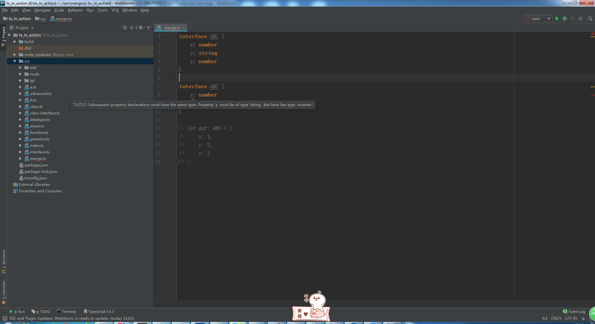
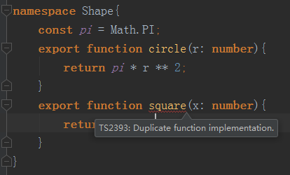
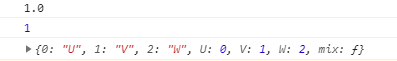

# 理解声明合并

> 练习
1. 我们先来定义两个接口
    ```typescript
    interface ABC {
        x: number
    }
    
    interface ABC {
        y: number
        z: number
    }
    ```
    
2. 发现他们的接口名是一样的，所以这里就会声明合并

3. 我们需要这样使用接口
    ```
    let gqf: ABC = {
        x: 1,
        y: 2,
        z: 3
    };
    ```    
4. 如果少写个参数就会报错，另外可以在ABC中定义一样的属性，但类型要一致，不一致会报错 

    
    
5. 下面在看下接口中的函数成员  
    1. 具体代码如下
        ```typescript
        interface ABC {
            x: number
            z: number
            foo(bar: number): number
        }
        
        interface ABC {
            y: number
            z: number
            foo(bar: string): string
            foo(bar: number[]): number[]
        }
        
        let gqf: ABC = {
            x: 1,
            y: 2,
            z: 3,
            foo: function(bar: any): any{
                return bar;
            }
        };
        ```     
        
    2. 很明显这边是个函数的重载   
    
6. 命名空间的合并
    1. 上章我们学习了命名空间，a.ts和b.ts都有Shape命名空间，
        与接口不同的是，如果我们在一个ts中，export两次就会报错
        
        
        
    2. 命名空间的其他合并
        1. 先看代码
            ```typescript
            function Lib() {
            
            }
            
            namespace Lib {
                export let version = '1.0';
            }
            
            console.log(Lib.version);
            
            class XYZ {
            
            }
            
            namespace XYZ {
                export let state = 1;
            }
            
            console.log(XYZ.state);
            
            enum UVW {
                U,
                V,
                W
            }
            
            namespace UVW {
                export function mix() {
            
                }
            }
            console.log(UVW);
            ```    
            
        2. 上述的合并分别是
            1. 与函数合并
            2. 与类合并
            3. 与枚举类型合并
            
        3. 控制台打印的结果
            
                    
    
        4. 补充
            1. 函数和命名空间的合并，函数必须写在命名空间前面否则会报错
            2. 类和命名空间的合并，类必须写在命名空间前面否则会报错 
            3. 枚举和命名空间合并，书写顺序前后没什么关系

> 目录

* [返回目录](../../README.md)            