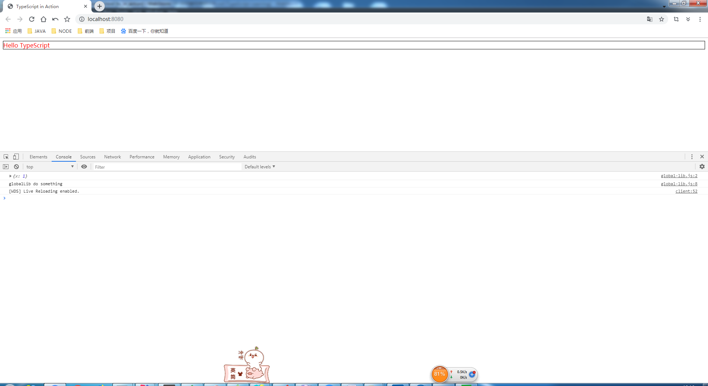
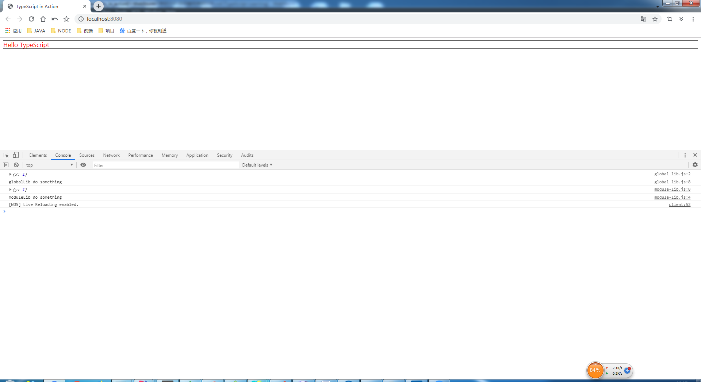
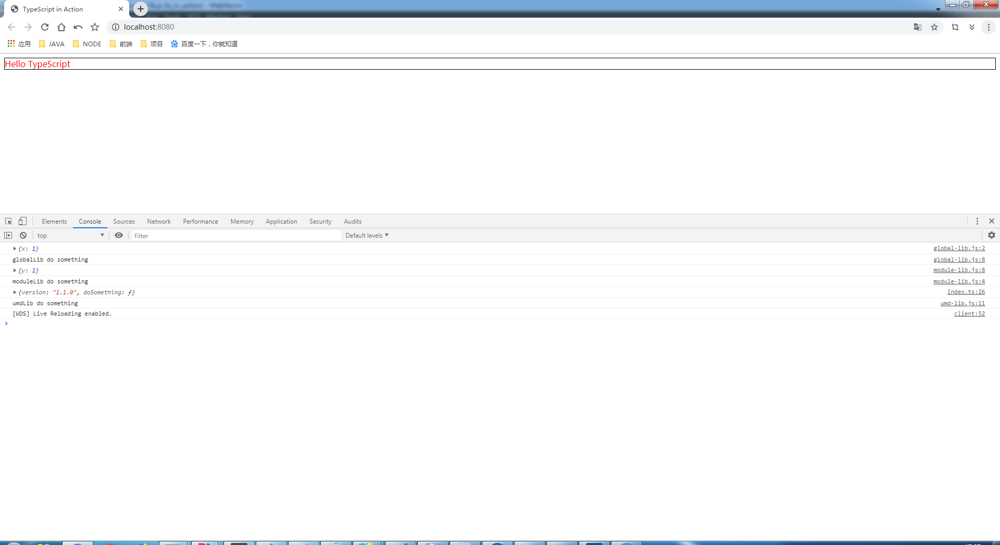
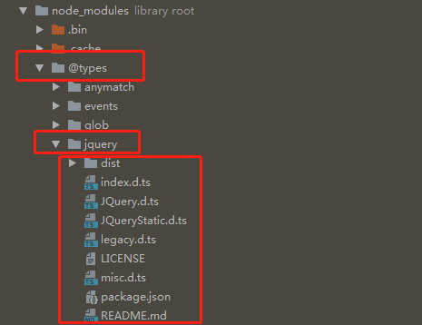
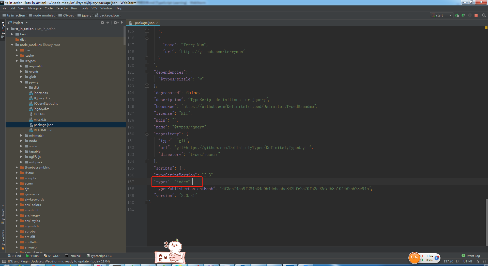
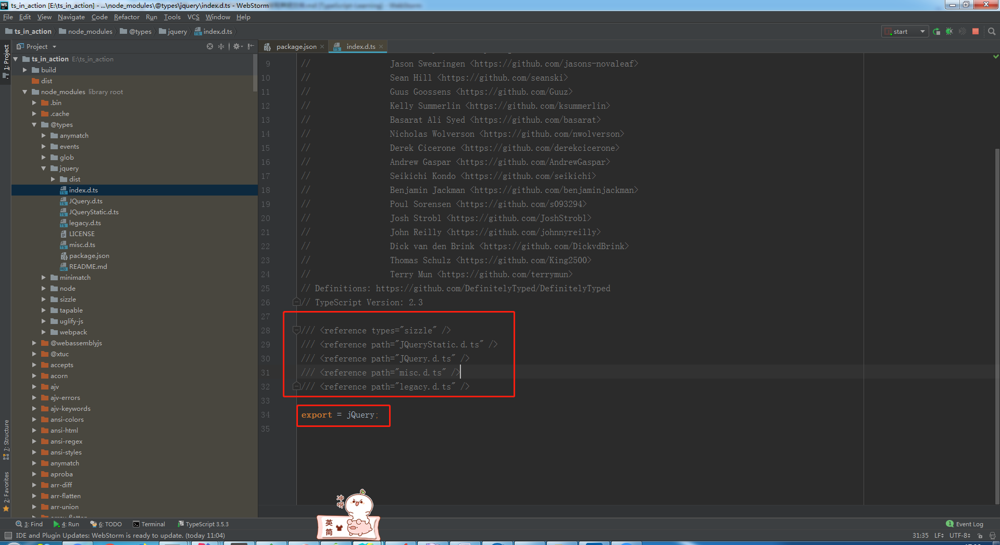
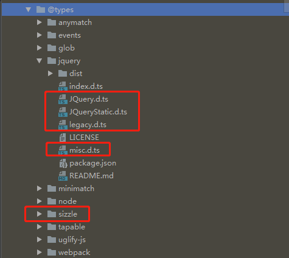

# 如何编写声明文件

> 练习
1. 萌新玩耍
    1. 我们弄个jq来玩玩，输入**npm i jquery**
        * 安装后我们在index.ts中引用jq，`import $ from 'jquery';`
        * 此时发现报错了，是因为ts医用外部库要使用声明文件
    2. 在输入指令**npm i @types/jquery -D**，安装后就发现不报错了
    3. 我们在之前index.ts中，使用jq给原先的文字加上样式
        ```
        import $ from 'jquery';
        
        let hello:string = "Hello TypeScript";
        
        document.querySelectorAll(".app")[0].innerHTML = hello;
        $(".app").css("color", "red").css("border", "1px solid black");
        ```
    4. 这个时候打开页面就发现样式就生效了
    5. 我们在ts中使用外部库的时候首先要考虑有没有声明文件，这边安装的@types/jquery就是声明文件    
    6. 可以[在这个网站](http://microsoft.github.io/TypeSearch/)查询你使用的包有没有声明文件
    7. 如果没有，就需要自己写一个，可以为社区做出贡献，[社区点击这里](http://definitelytyped.org/guides/contributing.html)

2. 学习如何编写声明文件
    1. 一共有三种库    
        1. 全局库
        2. 模块库
        3. umd库
        
    2. 我们在src下新建一个libs文件夹
        1. 新建一个**global-lib.js**，作为全局库
            * 编写js代码 
            
                ```
                function globalLib(options){
                    console.log(options);
                }
                
                globalLib.version = "1.0.0";
                
                globalLib.doSomething = function(){
                    console.log("globalLib do something");
                };
                ```   
            * 我们在index.html中使用引入这个js脚本        
            * 然后在index.ts中调用globalLib方法`globalLib({x: 1});`
            * 此时发现是报错的，是因为我们没有为globalLib写声明文件
            * 我们开始编写全局库的声明文件，新建个**global-lib.d.ts**
            * 代码如下
                ```typescript
                declare function globalLib(options: globalLib.Options): void;
                
                declare namespace globalLib{
                    const version: string;
                    function doSomething(): void;
                    interface Options {
                        [key: string]: any;
                    }
                }
                ```
            * 然后编译错误就消失了~，我们还可以在index.ts中在调用下doSomething的方法
                ```
                globalLib({x: 1});
                globalLib.doSomething();
                ```
            * 这个时候能看到控制台准确的打印出我们预期的效果    
            
                
                
        2. 新建一个**module-lib.js**，作为模块类库 
            * 编写js代码
                ```
                const version = "1.0.0";
                
                function doSomething(){
                    console.log("moduleLib do something");
                }
                
                function moduleLib(options){
                    console.log(options);
                }
                
                moduleLib.version = version;
                moduleLib.doSomething = doSomething;
                module.exports = moduleLib;
                ```           
            * `import moduleLib from './libs/module-lib';';`引入发现会报错也是因为声明文件的问题
            * 新建声明文件**module-lib.d.ts**  
                ```typescript
                declare function moduleLib(options: Options): void;
                
                interface Options {
                    [key: string]: any;
                }
                
                declare namespace moduleLib {
                    const version: string;
                    function doSomething(): void;
                }
                
                export = moduleLib;
                ```  
            * 历史惊人的相似，解决了报错的问题，老样子在index.ts里测试一把  
            
                ```
                import moduleLib from './libs/module-lib';
                
                moduleLib({y: 1});
                moduleLib.doSomething();
                ```
            
                  
                
        3. 新建一个**umd-lib.js**，作为umd库
            * 具体代码如下
                ```
                (function (root, factory) {
                    if (typeof module === "object" && module.exports) {
                        module.exports = factory();
                    } else {
                        root.umdLib = factory();
                    }
                }(this, function(){
                    return {
                        version: "1.1.0",
                        doSomething(){
                            console.log("umdLib do something");
                        }
                    }
                }));
                ```   
            * 在index.ts中引入进来`import umdLib from './libs/umd-lib';`
            * 结果肯定还是报错的，我们继续编写声明文件，新建**umd-lib.d.ts**
                ```typescript
                declare namespace umdLib{
                    const version: string;
                    function doSomething(): void;
                }
                
                export as namespace umdLib; //这条语句不可缺少
                export = umdLib;
                ```    
            * 我们调用测试下   
                ```
                import umdLib from './libs/umd-lib';
                umdLib.doSomething();
                ```           
                
                
                
            * 我们也可以通过全局的方式去引用umd
                1. 先在index.html中使用script标签引用js文件
                2. 把之前import umd的那句代码注释掉
                3. 此刻发现又报错了，我们去修改下**tsconfig.json**配置文件，打开注释**allowUmdGlobalAccess**
                4. 就解决了这个问题    
                
3. 补充
    1. 给外部类库增加自定义方法
        * 扩展下moment类库，新增自定义方法
        * 先**npm i moment**安装下   
        * 安装好在index.ts中导入进来`import m from 'moment'`
        * 比如这里我们要给moment自定义方法，方法叫**myFunction**   
        * `m.myFunction = () => {};`发现报错了
        * 我们还是可以继续用声明导出这个方法的方式处理这个问题 
            ```
            import m from 'moment';
            declare module 'moment'{
                export function myFunction(): void;
            }
            m.myFunction = () => {};
            ```        
        * 这就是模块化插件
    2. 全局插件，给globalLib添加自定义方法
        * 先上代码 
            ```
            declare global{
                namespace globalLib{
                    function doAnything(): void;
                }
            }
            globalLib.doAnything = () => {};
            ```  
        * 这样会污染全局命名空间，一般不建议这么做     
    3. 声明文件的依赖
        * 一个库比较大的话，声明文件会很长，一般会按照模块划分
        * 所以这些声明文件之间存在依赖关系
        * 我们可以看下jq的声明文件  
        
              
            
        * 我们先来看下package.json文件，找types这个属性，这个代表的是入口  
        
              
            
        * 我们看下入口文件
            
              
            
        * **d.ts**是相对路径下的依赖，第一个**sizzle**就是在**@types**中找依赖       
        
            
            

> 目录

* [返回目录](../../README.md)            
            